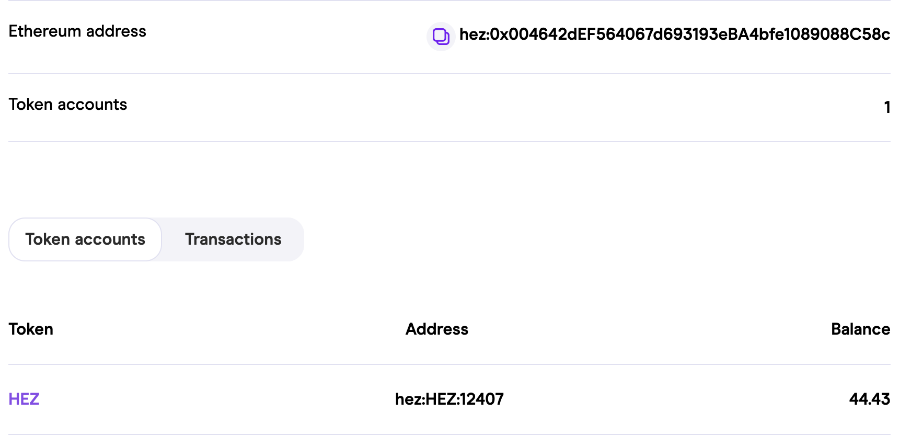

# Batch Explorer

## What is Hermez Block Explorer
Hermez Block Explorer, as the name suggests is a block explorer for the Hermez Network. It is a tool that allows anyone to search and lookup details about transactions, batches, coordinators, accounts or slots. It also provides basic information on the network performance.

## Batches
By searching for a particular batch number, or simply navigating to one, user is able to see the details of a given batch. Among other information the page displays:
* block hash
* status of a batch
* timestamp
* collected fees
* link to the coordinator in question
* link to the given slot, and
* a full list of transactions included in that batch

## Transactions
By searching for a transaction id, or simply clicking on one of the transaction links users land on a page showing all important details of that transaction. Such as:
* status of a batch
* timestamp
* transaction type
    * for an L1 transaction:
        * Exit
        * Transfer
        * Deposit
        * CreateAccountDeposit
        * CreateAccountDepositTransfer
        * DepositTransfer
        * ForceTransfer
        * ForceExit
        * TransferToEthAddr
        * TransferToBJJ
    * for an L2 transaction:
        * Exit
        * Transfer
        * TransferToEthAddr
        * TransferToBJJ
* id of a batch that transaction is part of

## User address
User address page is displaying basic information about the given Hermez Ethereum or BJJ address. That information includes the addresses themselves as well as a total number of token accounts.
Apart from that, basic information for each token as well as each related transaction is listed in two separate views.

## Slots
By navigating through a corresponding link, users land on the slot details page. Here are shown all relevant information for a slot, as:
* slot status (whether the auction of the slot is open or not)
* total number of bids
* bids details (including coordinator and the bid amount)

If a given slot auction is closed, the following information will be shown as well:
* list of batches included in that slot (with some details about each batch)

## Coordinator
By searching for the Ethereum address of an existing coordinator, or by navigating through the app the user lands on the page listing details of that coordinator. Those details include:
* forger and withdrawal addresses
* full list of forged batches
* full list of winner bids (including slot, total bids and bid amount)

## Searching through Hermez Batch Explorer
There are limited options available for search and navigation in the app itself. Those include:
* Ethereum address
* HEZ Ethereum address
* BJJ address
* Batch number
* Id of a Transaction
* Account index