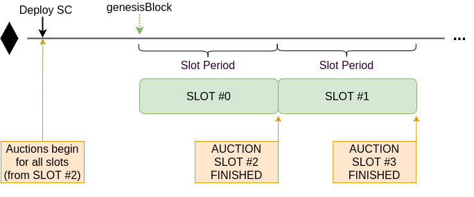
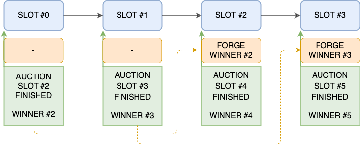

# Forging Consensus Protocol

Hermez will run an auction to incentivize the efficiency of coordinators, meaning that they need to be very effective and include as many transactions as they can in the slots in order to compensate for their bidding costs, gas costs and operations costs.

The general purpose of this protocol is to describe the rules to coordinate the auction where the bids will be placed only in HEZ utility token.

## General Goals

- Select a single coordinator for a given slot to forge a batch
- Avoid stops of ZK-Rollup
- Incentivize coordinators to participate in the ZK-Rollup

## Scenario

  - ZK-Rollup is divided into slots of a certain duration:
  - Ethereum Block = ~ 15s
  - Slot = 40 Ethereum Blocks = 40 \* 15s = 600s = 10 min
  - [Slot deadline](#free-coordinator-override) = 20

_**Note:** The number of blocks per slot is a parameter that is hardcoded on the smart contracts, so in order to change this parameter we need to make an upgrade on consensus smart contracts_

## Auction

Bids in the Auction will be placed only in HEZ. The auction of future slots will be open up to **1 month** (system parameter), the opening is a sliding window that opens a new slot every 40 blocks.

Auction will be closed **2 slots** (system parameter) before the start time of the forging in the slot.

A bid will not pay a premium on top of the previous bid, but a bid placed in the auction should be at least **1.1 times** (system parameter) the previous bid or over the minimum bidding price (if it's the first one) to be accepted as valid.

Auction will be structured in series of 6 slots `slots[5]`, with **10 HEZ** as initial minimal bidding price for all the slots. The governance can change this value `slots[i]` independently at any time and **affecting open auctions**, in such a way that all the slots whose `slot % 6 = i` will have the same minimum bid. Bids under the new minimal bidding price will not be considered as valid bids anymore and bidders (if no new bids outbid theirs) will be sent back their HEZ in the event that the slot is fully processed (forge).

When a slot number in the series gets **0 HEZ value**, it will be locked and governance will not be able to modify the minimal bidding price anymore, so **it will become decentralized**.

### HEZ Token Bidding Allocation

In the moment of placement, all bids in form of HEZ token placed in the auction will be stored in the smart contract, and will pay the gas to send the previous bidder their HEZ back.

Once the slot is forged, the tokens are assigned to **three** different accounts:

- A part of the tokens will be **burnt**. So they will not be at 0x0 address, but reduced from the total token amount.
- A part will be assigned to the **donations account**. Governance process will decide how to allocate these funds into different projects.
- The rest will be allocated as Hermez Network usage incentives, compensating active engagement and network adoption, e.g. rewarding transaction and rewarding the holding of specific tokens in Hermez L2 addresses, instead of on L1 Ethereum addresses.

## Boot Coordinator

This element has the mission to support the network bootstrap and at some moment will disappear when the network gains traction. Removal of the boot coordinator will be a governance decision.

Basically, its role is to forge any slot where there is no winner in the auction without the need to make a bid.

## Free Coordinator Override

There is a situation where any coordinator can forge batches without bidding.

This happens when the coordinator of the current slot doesn't forge any batch in the N first available inside the slot.

This mechanism responds to the need of the network for the efficiency of coordinators, and cover from potential technical problems or attacks.

It also provides a guarantee to users that all funds will be recoverable from the L2 network because there is a deadline after which a batch MUST include L1 pending transactions, which includes L2 (funds) exit operations.

## System Parameters

- **slotDeadline**
  - Number of blocks after the beginning of a slot after which any coordinator can forge if the winner has not forged any batch in that slot
  - **Default Value:** 20
- **closedAuctionSlots**
  - Distance (#slots) to the closest slot to which you can bid
  - **Default value:** 2 (2 Slots = 2 \* 40 Blocks = 2 \* 40 \* 15s = 20 min )
- **openAuctionSlots**
  - Distance (#slots) to the farthest slot to which you can bid
  - **Default value:** 4320 slots (30 days)
- **INITIAL_MINIMAL_BIDDING**
  - Minimum bid when no one has bid yet
  - **Default value:** 10 * (1e18)
- **outbidding**
  - Minimum outbid (percentage, two decimal precision) over the previous one to consider it valid
  - **Default value:** 1000
- **donationAddress**
  - **Default value:** _Pending to be defined_
- **governanceAddress**
  - **Default value:** _Pending to be defined_
- **bootCoordinator**
  - **Default value:** _Pending to be defined_
- **ALLOCATION_RATIO**
  - How the HEZ tokens deposited by the slot winner are distributed
  - **Default values:** Burn: 40.00% - Donation: 40.00% - HGT: 20.00%

_**Note:** All this parameters are managed by the governance, this means that they can change it at any time without any delay_
