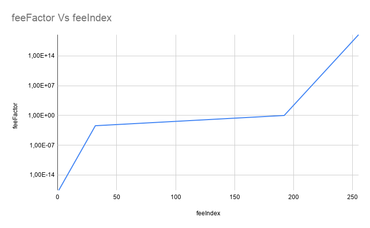

# Transaction Fee Table

Fees in L2 transaction apply a factor encoded by an index, as shown in the table above and the formula below:

$0 \quad \text{ if } i = 0$

$2^{-60 + i·(\frac{-8-(-60)}{32})} \quad \text{if} \quad 1 \leq i \leq 31$

$2^{-8 + (i-32)·(\frac{0-(-8)}{160})} \quad \text{if} \quad 32 \leq i \leq 191$

$2^{(i-192)·(\frac{63-0}{63})} \quad \text{if} \quad 192 \leq i \leq 255$

This is the complete table of the fees factors by fee index:

| feeIndex | feeExponent | feeFactor |
|:--------:|:-----------:|:---------:|
|    0     |      0      | 0,00E+00  |
|    1     |   -58,375   | 2,68E-18  |
|    2     |   -56,75    | 8,25E-18  |
|    3     |   -55,125   | 2,55E-17  |
|    4     |    -53,5    | 7,85E-17  |
|    5     |   -51,875   | 2,42E-16  |
|    6     |   -50,25    | 7,47E-16  |
|    7     |   -48,625   | 2,30E-15  |
|    8     |     -47     | 7,11E-15  |
|    9     |   -45,375   | 2,19E-14  |
|    10    |   -43,75    | 6,76E-14  |
|    11    |   -42,125   | 2,09E-13  |
|    12    |    -40,5    | 6,43E-13  |
|    13    |   -38,875   | 1,98E-12  |
|    14    |   -37,25    | 6,12E-12  |
|    15    |   -35,625   | 1,89E-11  |
|    16    |     -34     | 5,82E-11  |
|    17    |   -32,375   | 1,80E-10  |
|    18    |   -30,75    | 5,54E-10  |
|    19    |   -29,125   | 1,71E-09  |
|    20    |    -27,5    | 5,27E-09  |
|    21    |   -25,875   | 1,62E-08  |
|    22    |   -24,25    | 5,01E-08  |
|    23    |   -22,625   | 1,55E-07  |
|    24    |     -21     | 4,77E-07  |
|    25    |   -19,375   | 1,47E-06  |
|    26    |   -17,75    | 4,54E-06  |
|    27    |   -16,125   | 1,40E-05  |
|    28    |    -14,5    | 4,32E-05  |
|    29    |   -12,875   | 1,33E-04  |
|    30    |   -11,25    | 4,11E-04  |
|    31    |   -9,625    | 1,27E-03  |
|    32    |     -8      | 3,91E-03  |
|    33    |    -7,95    | 4,04E-03  |
|    34    |    -7,9     | 4,19E-03  |
|    35    |    -7,85    | 4,33E-03  |
|    36    |    -7,8     | 4,49E-03  |
|    37    |    -7,75    | 4,65E-03  |
|    38    |    -7,7     | 4,81E-03  |
|    39    |    -7,65    | 4,98E-03  |
|    40    |    -7,6     | 5,15E-03  |
|    41    |    -7,55    | 5,34E-03  |
|    42    |    -7,5     | 5,52E-03  |
|    43    |    -7,45    | 5,72E-03  |
|    44    |    -7,4     | 5,92E-03  |
|    45    |    -7,35    | 6,13E-03  |
|    46    |    -7,3     | 6,35E-03  |
|    47    |    -7,25    | 6,57E-03  |
|    48    |    -7,2     | 6,80E-03  |
|    49    |    -7,15    | 7,04E-03  |
|    50    |    -7,1     | 7,29E-03  |
|    51    |    -7,05    | 7,55E-03  |
|    52    |     -7      | 7,81E-03  |
|    53    |    -6,95    | 8,09E-03  |
|    54    |    -6,9     | 8,37E-03  |
|    55    |    -6,85    | 8,67E-03  |
|    56    |    -6,8     | 8,97E-03  |
|    57    |    -6,75    | 9,29E-03  |
|    58    |    -6,7     | 9,62E-03  |
|    59    |    -6,65    | 9,96E-03  |
|    60    |    -6,6     | 1,03E-02  |
|    61    |    -6,55    | 1,07E-02  |
|    62    |    -6,5     | 1,10E-02  |
|    63    |    -6,45    | 1,14E-02  |
|    64    |    -6,4     | 1,18E-02  |
|    65    |    -6,35    | 1,23E-02  |
|    66    |    -6,3     | 1,27E-02  |
|    67    |    -6,25    | 1,31E-02  |
|    68    |    -6,2     | 1,36E-02  |
|    69    |    -6,15    | 1,41E-02  |
|    70    |    -6,1     | 1,46E-02  |
|    71    |    -6,05    | 1,51E-02  |
|    72    |     -6      | 1,56E-02  |
|    73    |    -5,95    | 1,62E-02  |
|    74    |    -5,9     | 1,67E-02  |
|    75    |    -5,85    | 1,73E-02  |
|    76    |    -5,8     | 1,79E-02  |
|    77    |    -5,75    | 1,86E-02  |
|    78    |    -5,7     | 1,92E-02  |
|    79    |    -5,65    | 1,99E-02  |
|    80    |    -5,6     | 2,06E-02  |
|    81    |    -5,55    | 2,13E-02  |
|    82    |    -5,5     | 2,21E-02  |
|    83    |    -5,45    | 2,29E-02  |
|    84    |    -5,4     | 2,37E-02  |
|    85    |    -5,35    | 2,45E-02  |
|    86    |    -5,3     | 2,54E-02  |
|    87    |    -5,25    | 2,63E-02  |
|    88    |    -5,2     | 2,72E-02  |
|    89    |    -5,15    | 2,82E-02  |
|    90    |    -5,1     | 2,92E-02  |
|    91    |    -5,05    | 3,02E-02  |
|    92    |     -5      | 3,13E-02  |
|    93    |    -4,95    | 3,24E-02  |
|    94    |    -4,9     | 3,35E-02  |
|    95    |    -4,85    | 3,47E-02  |
|    96    |    -4,8     | 3,59E-02  |
|    97    |    -4,75    | 3,72E-02  |
|    98    |    -4,7     | 3,85E-02  |
|    99    |    -4,65    | 3,98E-02  |
|   100    |    -4,6     | 4,12E-02  |
|   101    |    -4,55    | 4,27E-02  |
|   102    |    -4,5     | 4,42E-02  |
|   103    |    -4,45    | 4,58E-02  |
|   104    |    -4,4     | 4,74E-02  |
|   105    |    -4,35    | 4,90E-02  |
|   106    |    -4,3     | 5,08E-02  |
|   107    |    -4,25    | 5,26E-02  |
|   108    |    -4,2     | 5,44E-02  |
|   109    |    -4,15    | 5,63E-02  |
|   110    |    -4,1     | 5,83E-02  |
|   111    |    -4,05    | 6,04E-02  |
|   112    |     -4      | 6,25E-02  |
|   113    |    -3,95    | 6,47E-02  |
|   114    |    -3,9     | 6,70E-02  |
|   115    |    -3,85    | 6,93E-02  |
|   116    |    -3,8     | 7,18E-02  |
|   117    |    -3,75    | 7,43E-02  |
|   118    |    -3,7     | 7,69E-02  |
|   119    |    -3,65    | 7,97E-02  |
|   120    |    -3,6     | 8,25E-02  |
|   121    |    -3,55    | 8,54E-02  |
|   122    |    -3,5     | 8,84E-02  |
|   123    |    -3,45    | 9,15E-02  |
|   124    |    -3,4     | 9,47E-02  |
|   125    |    -3,35    | 9,81E-02  |
|   126    |    -3,3     | 1,02E-01  |
|   127    |    -3,25    | 1,05E-01  |
|   128    |    -3,2     | 1,09E-01  |
|   129    |    -3,15    | 1,13E-01  |
|   130    |    -3,1     | 1,17E-01  |
|   131    |    -3,05    | 1,21E-01  |
|   132    |     -3      | 1,25E-01  |
|   133    |    -2,95    | 1,29E-01  |
|   134    |    -2,9     | 1,34E-01  |
|   135    |    -2,85    | 1,39E-01  |
|   136    |    -2,8     | 1,44E-01  |
|   137    |    -2,75    | 1,49E-01  |
|   138    |    -2,7     | 1,54E-01  |
|   139    |    -2,65    | 1,59E-01  |
|   140    |    -2,6     | 1,65E-01  |
|   141    |    -2,55    | 1,71E-01  |
|   142    |    -2,5     | 1,77E-01  |
|   143    |    -2,45    | 1,83E-01  |
|   144    |    -2,4     | 1,89E-01  |
|   145    |    -2,35    | 1,96E-01  |
|   146    |    -2,3     | 2,03E-01  |
|   147    |    -2,25    | 2,10E-01  |
|   148    |    -2,2     | 2,18E-01  |
|   149    |    -2,15    | 2,25E-01  |
|   150    |    -2,1     | 2,33E-01  |
|   151    |    -2,05    | 2,41E-01  |
|   152    |     -2      | 2,50E-01  |
|   153    |    -1,95    | 2,59E-01  |
|   154    |    -1,9     | 2,68E-01  |
|   155    |    -1,85    | 2,77E-01  |
|   156    |    -1,8     | 2,87E-01  |
|   157    |    -1,75    | 2,97E-01  |
|   158    |    -1,7     | 3,08E-01  |
|   159    |    -1,65    | 3,19E-01  |
|   160    |    -1,6     | 3,30E-01  |
|   161    |    -1,55    | 3,42E-01  |
|   162    |    -1,5     | 3,54E-01  |
|   163    |    -1,45    | 3,66E-01  |
|   164    |    -1,4     | 3,79E-01  |
|   165    |    -1,35    | 3,92E-01  |
|   166    |    -1,3     | 4,06E-01  |
|   167    |    -1,25    | 4,20E-01  |
|   168    |    -1,2     | 4,35E-01  |
|   169    |    -1,15    | 4,51E-01  |
|   170    |    -1,1     | 4,67E-01  |
|   171    |    -1,05    | 4,83E-01  |
|   172    |     -1      | 5,00E-01  |
|   173    |    -0,95    | 5,18E-01  |
|   174    |    -0,9     | 5,36E-01  |
|   175    |    -0,85    | 5,55E-01  |
|   176    |    -0,8     | 5,74E-01  |
|   177    |    -0,75    | 5,95E-01  |
|   178    |    -0,7     | 6,16E-01  |
|   179    |    -0,65    | 6,37E-01  |
|   180    |    -0,6     | 6,60E-01  |
|   181    |    -0,55    | 6,83E-01  |
|   182    |    -0,5     | 7,07E-01  |
|   183    |    -0,45    | 7,32E-01  |
|   184    |    -0,4     | 7,58E-01  |
|   185    |    -0,35    | 7,85E-01  |
|   186    |    -0,3     | 8,12E-01  |
|   187    |    -0,25    | 8,41E-01  |
|   188    |    -0,2     | 8,71E-01  |
|   189    |    -0,15    | 9,01E-01  |
|   190    |    -0,1     | 9,33E-01  |
|   191    |    -0,05    | 9,66E-01  |
|   192    |      0      | 1,00E+00  |
|   193    |      1      | 2,00E+00  |
|   194    |      2      | 4,00E+00  |
|   195    |      3      | 8,00E+00  |
|   196    |      4      | 1,60E+01  |
|   197    |      5      | 3,20E+01  |
|   198    |      6      | 6,40E+01  |
|   199    |      7      | 1,28E+02  |
|   200    |      8      | 2,56E+02  |
|   201    |      9      | 5,12E+02  |
|   202    |     10      | 1,02E+03  |
|   203    |     11      | 2,05E+03  |
|   204    |     12      | 4,10E+03  |
|   205    |     13      | 8,19E+03  |
|   206    |     14      | 1,64E+04  |
|   207    |     15      | 3,28E+04  |
|   208    |     16      | 6,55E+04  |
|   209    |     17      | 1,31E+05  |
|   210    |     18      | 2,62E+05  |
|   211    |     19      | 5,24E+05  |
|   212    |     20      | 1,05E+06  |
|   213    |     21      | 2,10E+06  |
|   214    |     22      | 4,19E+06  |
|   215    |     23      | 8,39E+06  |
|   216    |     24      | 1,68E+07  |
|   217    |     25      | 3,36E+07  |
|   218    |     26      | 6,71E+07  |
|   219    |     27      | 1,34E+08  |
|   220    |     28      | 2,68E+08  |
|   221    |     29      | 5,37E+08  |
|   222    |     30      | 1,07E+09  |
|   223    |     31      | 2,15E+09  |
|   224    |     32      | 4,29E+09  |
|   225    |     33      | 8,59E+09  |
|   226    |     34      | 1,72E+10  |
|   227    |     35      | 3,44E+10  |
|   228    |     36      | 6,87E+10  |
|   229    |     37      | 1,37E+11  |
|   230    |     38      | 2,75E+11  |
|   231    |     39      | 5,50E+11  |
|   232    |     40      | 1,10E+12  |
|   233    |     41      | 2,20E+12  |
|   234    |     42      | 4,40E+12  |
|   235    |     43      | 8,80E+12  |
|   236    |     44      | 1,76E+13  |
|   237    |     45      | 3,52E+13  |
|   238    |     46      | 7,04E+13  |
|   239    |     47      | 1,41E+14  |
|   240    |     48      | 2,81E+14  |
|   241    |     49      | 5,63E+14  |
|   242    |     50      | 1,13E+15  |
|   243    |     51      | 2,25E+15  |
|   244    |     52      | 4,50E+15  |
|   245    |     53      | 9,01E+15  |
|   246    |     54      | 1,80E+16  |
|   247    |     55      | 3,60E+16  |
|   248    |     56      | 7,21E+16  |
|   249    |     57      | 1,44E+17  |
|   250    |     58      | 2,88E+17  |
|   251    |     59      | 5,76E+17  |
|   252    |     60      | 1,15E+18  |
|   253    |     61      | 2,31E+18  |
|   254    |     62      | 4,61E+18  |
|   255    |     63      | 9,22E+18  |

## FeeFactor left shifted

Fee factor is shifted according:
  - $\text{bitsShiftPrecision} = 60$
  - $\text{feeFactorShifted} = (\text{feeFactor} << \text{bitsShiftPrecison}) \quad \text{if} \quad i < 192$
  - $\text{feeFactorShifted} = \text{feeFactor} \quad \text{if} \quad i \geq 192$

| feeIndex |  feeFactorShifted   |
|:--------:|:-------------------:|
|    0     |          0          |
|    1     |          3          |
|    2     |          9          |
|    3     |         29          |
|    4     |         90          |
|    5     |         279         |
|    6     |         861         |
|    7     |        2655         |
|    8     |        8192         |
|    9     |        25267        |
|    10    |        77935        |
|    11    |       240387        |
|    12    |       741455        |
|    13    |       2286960       |
|    14    |       7053950       |
|    15    |      21757357       |
|    16    |      67108864       |
|    17    |      206992033      |
|    18    |      638450708      |
|    19    |     1969251187      |
|    20    |     6074000999      |
|    21    |     18734780191     |
|    22    |     57785961645     |
|    23    |    178236271212     |
|    24    |    549755813888     |
|    25    |    1695678735018    |
|    26    |    5230188203117    |
|    27    |   16132105731538    |
|    28    |   49758216191607    |
|    29    |   153475319327371   |
|    30    |   473382597799226   |
|    31    |  1460111533771401   |
|    32    |  4503599627370496   |
|    33    |  4662418725241772   |
|    34    |  4826838566504035   |
|    35    |  4997056660946426   |
|    36    |  5173277483525749   |
|    37    |  5355712719992597   |
|    38    |  5544581521179432   |
|    39    |  5740110766256133   |
|    40    |  5942535335269230   |
|    41    |  6152098391292193   |
|    42    |  6369051672525772   |
|    43    |  6593655794699191   |
|    44    |  6826180564135515   |
|    45    |  7066905301857248   |
|    46    |  7316119179121470   |
|    47    |  7574121564787630   |
|    48    |  7841222384935199   |
|    49    |  8117742495163242   |
|    50    |  8404014066019092   |
|    51    |  8700380982019120   |
|    52    |  9007199254740992   |
|    53    |  9324837450483544   |
|    54    |  9653677133008070   |
|    55    |  9994113321892852   |
|    56    |  10346554967051498  |
|    57    |  10711425439985194  |
|    58    |  11089163042358864  |
|    59    |  11480221532512266  |
|    60    |  11885070670538460  |
|    61    |  12304196782584386  |
|    62    |  12738103345051544  |
|    63    |  13187311589398382  |
|    64    |  13652361128271030  |
|    65    |  14133810603714496  |
|    66    |  14632238358242940  |
|    67    |  15148243129575260  |
|    68    |  15682444769870398  |
|    69    |  16235484990326484  |
|    70    |  16808028132038184  |
|    71    |  17400761964038240  |
|    72    |  18014398509481984  |
|    73    |  18649674900967100  |
|    74    |  19307354266016140  |
|    75    |  19988226643785704  |
|    76    |  20693109934102996  |
|    77    |  21422850879970388  |
|    78    |  22178326084717744  |
|    79    |  22960443065024532  |
|    80    |  23770141341076920  |
|    81    |  24608393565168772  |
|    82    |  25476206690103088  |
|    83    |  26374623178796784  |
|    84    |  27304722256542060  |
|    85    |  28267621207428992  |
|    86    |  29264476716485880  |
|    87    |  30296486259150520  |
|    88    |  31364889539740816  |
|    89    |  32470969980652968  |
|    90    |  33616056264076368  |
|    91    |  34801523928076480  |
|    92    |  36028797018963968  |
|    93    |  37299349801934200  |
|    94    |  38614708532032280  |
|    95    |  39976453287571408  |
|    96    |  41386219868205992  |
|    97    |  42845701759940776  |
|    98    |  44356652169435488  |
|    99    |  45920886130049064  |
|   100    |  47540282682153840  |
|   101    |  49216787130337544  |
|   102    |  50952413380206176  |
|   103    |  52749246357593568  |
|   104    |  54609444513084120  |
|   105    |  56535242414857984  |
|   106    |  58528953432971760  |
|   107    |  60592972518301040  |
|   108    |  62729779079481632  |
|   109    |  64941939961305936  |
|   110    |  67232112528152736  |
|   111    |  69603047856152960  |
|   112    |  72057594037927936  |
|   113    |  74598699603868352  |
|   114    |  77229417064064608  |
|   115    |  79952906575142816  |
|   116    |  82772439736411984  |
|   117    |  85691403519881552  |
|   118    |  88713304338870912  |
|   119    |  91841772260098192  |
|   120    |  95080565364307680  |
|   121    |  98433574260675088  |
|   122    | 101904826760412352  |
|   123    | 105498492715187056  |
|   124    | 109218889026168304  |
|   125    | 113070484829715968  |
|   126    | 117057906865943520  |
|   127    | 121185945036602080  |
|   128    | 125459558158963264  |
|   129    | 129883879922611968  |
|   130    | 134464225056305472  |
|   131    | 139206095712305920  |
|   132    | 144115188075855872  |
|   133    | 149197399207736800  |
|   134    | 154458834128129216  |
|   135    | 159905813150285632  |
|   136    | 165544879472823968  |
|   137    | 171382807039763104  |
|   138    | 177426608677741952  |
|   139    | 183683544520196384  |
|   140    | 190161130728615360  |
|   141    | 196867148521350176  |
|   142    | 203809653520824704  |
|   143    | 210996985430374272  |
|   144    | 218437778052336608  |
|   145    | 226140969659431936  |
|   146    | 234115813731887040  |
|   147    | 242371890073204160  |
|   148    | 250919116317926528  |
|   149    | 259767759845223936  |
|   150    | 268928450112610944  |
|   151    | 278412191424611840  |
|   152    | 288230376151711744  |
|   153    | 298394798415473600  |
|   154    | 308917668256258432  |
|   155    | 319811626300571264  |
|   156    | 331089758945647936  |
|   157    | 342765614079526208  |
|   158    | 354853217355483904  |
|   159    | 367367089040392768  |
|   160    | 380322261457230720  |
|   161    | 393734297042700352  |
|   162    | 407619307041649408  |
|   163    | 421993970860748544  |
|   164    | 436875556104673216  |
|   165    | 452281939318863872  |
|   166    | 468231627463774080  |
|   167    | 484743780146408320  |
|   168    | 501838232635853056  |
|   169    | 519535519690447872  |
|   170    | 537856900225221888  |
|   171    | 556824382849223680  |
|   172    | 576460752303423488  |
|   173    | 596789596830947200  |
|   174    | 617835336512516864  |
|   175    | 639623252601142528  |
|   176    | 662179517891295872  |
|   177    | 685531228159052416  |
|   178    | 709706434710967808  |
|   179    | 734734178080785536  |
|   180    | 760644522914461440  |
|   181    | 787468594085400704  |
|   182    | 815238614083298816  |
|   183    | 843987941721497088  |
|   184    | 873751112209346432  |
|   185    | 904563878637727744  |
|   186    | 936463254927548160  |
|   187    | 969487560292816640  |
|   188    | 1003676465271706112 |
|   189    | 1039071039380895744 |
|   190    | 1075713800450443776 |
|   191    | 1113648765698447360 |
|   192    |          1          |
|   193    |          2          |
|   194    |          4          |
|   195    |          8          |
|   196    |         16          |
|   197    |         32          |
|   198    |         64          |
|   199    |         128         |
|   200    |         256         |
|   201    |         512         |
|   202    |        1024         |
|   203    |        2048         |
|   204    |        4096         |
|   205    |        8192         |
|   206    |        16384        |
|   207    |        32768        |
|   208    |        65536        |
|   209    |       131072        |
|   210    |       262144        |
|   211    |       524288        |
|   212    |       1048576       |
|   213    |       2097152       |
|   214    |       4194304       |
|   215    |       8388608       |
|   216    |      16777216       |
|   217    |      33554432       |
|   218    |      67108864       |
|   219    |      134217728      |
|   220    |      268435456      |
|   221    |      536870912      |
|   222    |     1073741824      |
|   223    |     2147483648      |
|   224    |     4294967296      |
|   225    |     8589934592      |
|   226    |     17179869184     |
|   227    |     34359738368     |
|   228    |     68719476736     |
|   229    |    137438953472     |
|   230    |    274877906944     |
|   231    |    549755813888     |
|   232    |    1099511627776    |
|   233    |    2199023255552    |
|   234    |    4398046511104    |
|   235    |    8796093022208    |
|   236    |   17592186044416    |
|   237    |   35184372088832    |
|   238    |   70368744177664    |
|   239    |   140737488355328   |
|   240    |   281474976710656   |
|   241    |   562949953421312   |
|   242    |  1125899906842624   |
|   243    |  2251799813685248   |
|   244    |  4503599627370496   |
|   245    |  9007199254740992   |
|   246    |  18014398509481984  |
|   247    |  36028797018963968  |
|   248    |  72057594037927936  |
|   249    | 144115188075855872  |
|   250    | 288230376151711744  |
|   251    | 576460752303423488  |
|   252    | 1152921504606846976 |
|   253    | 2305843009213693952 |
|   254    | 4611686018427387904 |
|   255    | 9223372036854775808 |
