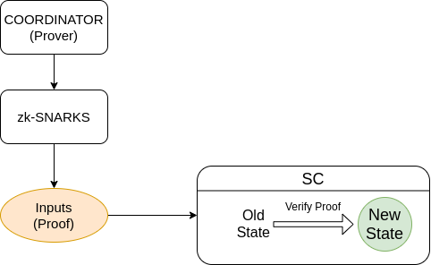
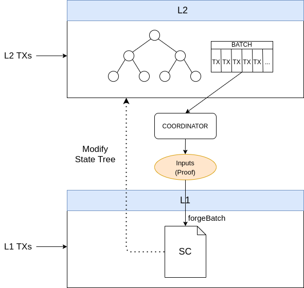

# Hermez ZK-Rollup Protocol

## Overview
The core protocol ensures that state transitions are valid through a validity proof which will assure that certain rules have been fulfilled.
This collection of rules are determined by a smart contract which will validate a proof of state transition. This verification will check that each state transitioning is made correctly. This is achieved by using a ZK-SNARK circuit and it will make sure that all rules for state transition are being followed.
Any prover must submit a proof in order to demonstrate the correctness of the state transition computation.

A prover (aka coordinator) is in charge of computing all state changes and calculating the ZK-SNARK proof. The coordinator will be in charge of submitting the ZK-SNARK to the verifier (smart contract) which will ensure state transition validation.




A sparse-Merkle-tree is used to keep the state data where all accounts and balances are stored. This information is kept on L2 and users will sign transactions in order to spend their balances between L2 accounts. These L2 transactions are collected together to create a batch. Afterward, batch data is compressed through a ZK-SNARK and it will prove that the state transitions of all those L2 transactions are correct.

This collection of transactions are made public on L1 in order to provide data-availability to the protocol, meaning that anyone can re-build the L2 state just depending on L1 data. Hence, there is no need to rely on third parties to provide or store this data.

The system is composed of L1 and L2 transactions:
- L1 transactions are the ones that are executed through the smart contract and affect the L2 state tree
- L2 transactions are the ones that are executed exclusively on L2 and affect the L2 state tree




L1 transactions are forced to be executed by the coordinator in the protocol. Therefore, these kinds of transactions will be always forged at some time.
L2 transactions are generated off-chain by the users and they are sent to the coordinators. Coordinators will be in charge of gathering them.

Some of the rollup functionality depends on a consensus mechanism to decide who
can be the coordinator of a given batch.  Separate from the rollup smart
contract (which mainly handles the queue of L1UserTxs and the forging of
batches), there is an external smart contract that implements the consensus
mechanism and maintains its own state.  During a forge call in the rollup smart
contract, a call is made to the consensus smart contract to validate if the
caller coordinator is allowed to forge and also to allow the consensus smart
contract to update its own state and perform consensus actions if necessary.

## Assumptions
- L1 (Ethereum):
  - integrity and immutability of data
- Hashes
  - `Poseidon` is unbreakable and collision-resistant
  - `SHA256` is unbreakable and collision-resistant
- Elliptic curves:
  - L1:
    - `secp256k1`
    - signature scheme is `ecdsa`
  - L2:
    - `BabyJubjub`
    - signature scheme is `eddsa`
- State tree transitions are always valid
- L1 transactions are forced to be processed

## Notation
- `H`: is the poseidon hash function
- elements are always encoded in big endian

> Big endian encoding is used since it fits better with EVM encoding

### Field Element
- the value encoded in a field element must be smaller than the field order
- first value corresponds to a less significant part of the field
```
dataField:  [16 bits] tokenID
            [16 bits] nonce
            [1 bit  ] sign
```

> Example:
> ```
> dataFieldExample: [16 bits] tokenID = 5
                  [16 bits] nonce = 4
                  [1 bit  ] sign = 1
> dataFieldExample (large integer) = 4295229445;
> dataFieldExample (hexadecimal padded 32 bytes) = 0x0000000000000000000000000000000000000000000000000000000100040005;
> ```

### Buffer Bytes
- first value corresponds to the first byte of the array
```
dataBuffer: [48 bits] fromIdx
            [32 bits] tokenID
            [16 bit ] amountFloat
```

> Example:
> ```
> dataBufferExample:  [48 bits] fromIdx = 5
                    [32 bits] tokenID = 4
                    [16 bit ] amountFloat = 20
> dataBufferExample (hexadecimal) = 0x000000000005000000040014;
> ```

## Global Settings

### Circuit
- `MAX_NLEVELS`: absolute maximum of Merkle tree depth (48 bits)
  - determines the maximum number of accounts that can exist in the ZK-Rollup: $MAX\_ACCOUNTS=2^{MAX\_NLEVELS}$
- `MAX_TX`: absolute maximum L1 or L2 transactions allowed to process in one batch
- `MAX_L1_TXS`: absolute maximum of L1 transactions allowed to process in one batch
- `MAX_FEE_TX`: maximum number of tokens that the coordinator is able to collect fees from in a batch from the included transactions
- `NLevels`: Merkle tree depth
  - It should be noted that `NLevels` is always a multiple of 8

### Contracts
- `MAX_L1_USER_TXS`: absolute maximum of L1 user transactions allowed to be queued for a batch
- `MAX_AMOUNT_DEPOSIT`: maximum amount of tokens that can be added when creating a new account
- `INITIAL_IDX`: first Merkle tree index to populate if a new account is created
  - Some indexes are reserved in order to specify special transactions
    - `IDX 0`: null index
    - `IDX 1`: exit
    - `2 <= IDX < 256`: reserved Idx values for future uses
    - `256 <= IDX < 2^MAX_NLEVELS`: available Idx values for rollup accounts
- `MAX_TOKENS`: maximum amount of tokens allowed to be registered in the ZK-Rollup

## Data Types
### Floating Point Format (Float40)
A custom floating point, 40 bits, codification internally called Float40
has been adopted to encode large integers. This is done in order to save bits
when L2 transactions are published.

Formula is as follows:

$v = m \times 10^e$

where:
- `v`: large integer value to encode
- `m`: mantissa (35 bits)
- `e`: exponent (5 bits)

bit position:
```
[   e    |    m   ]
[ 5 bits | 35 bits]
```

### Account
- `idx`: integer, path in the sparse Merkle tree (NLevels bits)
- `sign`: Baby Jubjub sign (1 bit)
- `ay`: Baby Jubjub public key Y coordinate (253 bits)
- `ethAddr`: Ethereum address (160 bits)
- `tokenID`: token identifier (32 bits)
- `balance`: balance (192 bits)
- `nonce`: nonce (40 bits)

### Transaction Fields
All transactions fields are required to build the ZK-SNARK proof but depending on the transaction type not all of them are used.
Detailed transaction types can be seen in [transaction type section](#Transaction-Types)
Below is a summary of each transaction field and its explaination:

- `signature_constant`: hardcoded transaction constant that indicates that the user is signing a Hermez rollup transaction. Used to avoid transaction replay in case other rollup are deployed (32 bits)
```
signature_constant = sha256("I authorize this hermez rollup transaction")[:32/8]
```
- `chainId`: Ethereum chain identifier in order to prevent replay attacks in case of hardforks, we use only 2 bytes since Hermez is only expected to be deployed in the Ethereum mainnet or one of its tesnets, so only 2 bytes are needed (16 bits)
- `amountFloat40`: number of tokens to transfer inside the ZK-Rollup (40 bits)
- `tokenID`: token identifier (32 bits)
- `nonce`: nonce (40 bits)
- `feeSelector`: select %fee to apply (8 bits)
- `maxNumBatch`: maximum allowed batch number when the transaction can be processed (32 bits)
- `onChain`: mark transaction as L1 transaction (1 bit)
- `newAccount`: mark transaction to create new account (1 bit)
- `fromIdx`: sender account index (NLevels bits)
- `fromBjjCompressed`: sender Baby Jubjub public key compressed (256 bits)
- `fromEthAddr`: sender Ethereum address (160 bits)
- `toIdx`: recipient account index (NLevels bits)
- `toEthAddr`: recipient Ethereum address (160 bits)
- `toBjjSign`: recipient Baby Jubjub sign (1 bits)
- `toAy`: recipient Baby Jubjub public key Y coordinate (253 bits)
- `loadAmountFloat40`: L1 amount transfered to L2 (40 bits)
- `txCompressedData`: transaction fields joined together that fit into a single field element (253 bits) [See L2Tx specification](#l2)
- `txCompressedDataV2`: transaction fields joined together used for other transactions when using atomic transactions feature (193 bits) [See L2Tx specification](#l2)
- `rqOffset`: relative transaction position to be linked. Used to perform atomic transactions (3 bits)
- `rqTxCompressedDataV2`: requested `txCompressedDataV2`
- `rqToEthAddr`: requested `toEthAddr`
- `rqToBjjAy`: requested `toBjj`

Fields to perform atomic transactions:
- `rqTxCompressedDataV2`
- `rqToEthAddr`
- `rqToBjjAy`
- `rqOffset`

## Trees
- It is assured by protocol a unique `idx` for each account. Therefore, a given `idx` identifies uniquely a ZK-Rollup account
- `idx` is incremented sequentially and it is assured by protocol


### State tree
Sparse Merkle tree is used to represent the whole ZK-Rollup state which is identified by its root.
Each leaf of the state tree (account) contains the following data:

- Key: Merkle tree index (`idx`)
- Value: `Hash(state)`
    ```
    **field element notation**
    State hash = H(e0, e1, e2, e3)

    e_0: [ 32 bits  ] tokenID
         [ 40 bits  ] nonce
         [  1 bit   ] sign
    e_1: [ 192 bits ] balance
    e_2: [ 253 bits ] ay
    e_3: [ 160 bits ] ethAddr
    ```

All data is hashed with Poseidon hash function and inserted into the sparse Merkle tree as a key-value pair.

This approach implies a balanced Merkle tree: path is traversed from the root starting with the least significant bit out of the NLevels bits.
This allows to have as many accounts as the tree levels:

$MAX\_ACCOUNTS$ = $2^{MAX\_NLEVELS}$

### Exit Tree
Each batch would have an associated exit tree with all the exits performed by the user, either L1 or L2 exit transactions.
The exit tree has the same leaf structure as the state tree with some particularities:
- nonce is always set to 0
- if several exits are done in the same batch for the same account, the balance is just added on top of the account

User will need to prove that it owns a leaf in the exit tree in order to perform its withdraw and get back the tokens from the contract. This verification could be done either by submitting a Merkle tree proof or by submitting a ZK Proof.

## Account Types

### Regular Rollup Account


Regular accounts contain an Ethereum address and a Baby Jubjub public key.  Accounts are always indexed by Ethereum address in the UX, so it is a requirement that the Ethereum address authorizes the account keys.  Once the account is created, the Ethereum key is used to authorize L1 txs and the Baby Jubjub key is used to authorize L2 txs.
There are two ways to authorize an account creation (that is, an Ethereum address authorizes the creation of an account containing that same Ethereum address and a Baby Jubjub public key):
- Via Ethereum transaction, which has an implicit signature of the Ethereum address.  This requires the owner of the Ethereum address to sign the smart contract transaction call
- Via an authorization signature (`AccountCreationAuthSig`) that can be used by any party to create accounts on behalf of the user

`AccountCreationAuthSig` specification (follows [ethereum eip712](https://eips.ethereum.org/EIPS/eip-712)):

```
domain: {
  name: "Hermez Network",
  version: "1",
  chainId: chainID,
  verifyingContract: rollupContractAddress
}

structured typed data: {
  Authorise: [
      { name: "Provider", type: "string" },
      { name: "Authorisation", type: "string" },
      { name: "BJJKey", type: "bytes32" }
  ]
}

structured data: {
  Provider: "Hermez Network",
  Authorisation: "Account creation",
  BJJKey: compressed-bjj
}
```

where:
- `chainID`: refers to the ethereum chain identifier
- `rollupContractAddress`: rollup contract ethereum address
- `compressed-bjj`: babyjubjub public key in its compressed format represented as hexadecimal string

`signature = eth_signTypedData(domain, types, value)`

Further details on `eth_signTypedData` can be found [here](https://eips.ethereum.org/EIPS/eip-712#specification-of-the-eth_signtypeddata-json-rpc)

### Internal Rollup Account

An internal rollup account does not use an Ethereum address, and thus can only operate via L2 txs.  Since no Ethereum address is involved, the account creation does not require an authorization and will only specify the Baby Jubjub public key.  Internally, this account will have the `ethAddr = 0xffff..`.


## Transaction Types

Table of possible combinations of actions in an L1User transaction:

| CreateAccount | Deposit | Transfer | Exit | Valid | Name |
| --- | --- | --- | --- | --- |:-------------------------------:|
|     |     |     |     | NO  |                                 |
|     |     |     | X   | YES |            ForceExit            |
|     |     | X   |     | YES |          ForceTransfer          |
|     |     | X   | X   | NO  |                                 |
|     | X   |     |     | YES |             Deposit             |
|     | X   |     | X   | NO  |                                 |
|     | X   | X   |     | YES |       DepositTransfer           |
|     | X   | X   | X   | NO  |                                 |
| X   |     |     |     | NO  |                                 |
| X   |     |     | X   | NO  |                                 |
| X   |     | X   |     | NO  |                                 |
| X   |     | X   | X   | NO  |                                 |
| X   | X   |     |     | YES |      CreateAccountDeposit       |
| X   | X   |     | X   | NO  |                                 |
| X   | X   | X   |     | YES | CreateAccountDepositTransfer    |
| X   | X   | X   | X   | NO  |                                 |

Summary:

- RollupTx
    - L1
        - User
            - [CreateAccountDeposit](#CreateAccountDeposit)
            - [CreateAccountDepositTransfer](#CreateAccountDepositTransfer)
            - [Deposit](#Deposit)
            - [DepositTransfer](#DepositTransfer)
            - [ForceTransfer](#ForceTransfer)
            - [ForceExit](#ForceExit)
        - Coordinator
            - [CreateAccountEth](#CreateAccountEth)
            - [CreateAccountBjj](#CreateAccountBjj)
    - L2
        - [Transfer](#Transfer)
        - [Exit](#Exit)
        - [TransferToEthAddr](#TransferToEthAddr)
        - [TransferToBjj](#TransferToBjj)
- HermezWithdraw

**RollupTx** is any transaction that is processed in the rollup state through a
ZK-SNARK proof.

**HermezWithdraw** is a transaction performed through the smart contract to get
funds back from the smart contract to Ethereum address. This is done by
demonstrating the existence of a leaf in the exit tree.

**NOP transaction** is an empty transaction that does not perform any action.  Used in the circuit inputs when the coordinator does not have enough transactions to fill maximum number of transactions in a batch.
**NULL transaction** is a transaction that is forced to use the value 0 for amount or loadAmount.  Used to nullify an `L1UserTx` that is found to be invalid, so that it does not do any update to the state tree.

### L1 user transactions
All L1 data transactions are concatenated together and hashed in order to force the coordinator to process them.
Since the operator is forced to process L1 transactions, those transactions have to accomplish certain rules to be processed by the circuit. If any of those rules are not fulfilled the transaction will be considered as a NULL transaction.
> If any user tries to flood L1 transactions with invalid transactions, it will have to pay fees associated to L1 transactions

Data of the transaction that is concatenated, hashed with sha256 and used as a public input in the circuit:
```
**Buffer bytes notation**
L1TxFullData: [     160 bits     ] fromEthAddr
              [     256 bits     ] fromBjj-compressed
              [ MAX_NLEVELS bits ] fromIdx
              [      40 bits     ] loadAmountFloat40
              [      40 bits     ] amountFloat40
              [      32 bits     ] tokenID
              [ MAX_NLEVELS bits ] toIdx

L1TxFullData length: 624 bits / 78 bytes

L1TxsFullData = L1TxFullData[0] || L1TxFullData[1] || ... || L1TxFullData[len(L1Txs) - 1] || zero[(len(L1Txs)] || ... || zero[MAX_L1_TX - 1]
```

All L1 txs that perform a transfer or exit must be approved by the Ethereum address of the account.  This is indicated by setting the `fromEthAddr` as the `message.sender`, which is the address that signs the L1 tx.

#### CreateAccountDeposit
- Inputs:
  - `fromEthAddr`: message.sender
  - `fromBjj-compressed`: user parameter
  - `fromIdx`: 0
  - `loadAmountFloat40`: user parameter
  - `amountFloat40`: 0
  - `tokenId`: user parameter
  - `toIdx`: 0
- Actions:
  - new account inserted into the state tree with idx = `auxFromIdx`
  - deposit `loadAmountFloat40` into the sender `auxFromIdx`
    - new account data:
        - `ax`: `fromBjj-compressed -> ax`
        - `ay`: `fromBjj-compressed -> ay`
        - `ethAddr`: `fromEthAddr`
        - `tokenID`: `tokenId`
        - `balance`: `loadAmount`
        - `nonce`: 0
- Requirements:

#### CreateAccountDepositTransfer
- Inputs:
  - `fromEthAddr`: message.sender
  - `fromBjj-compressed`: user parameter
  - `fromIdx`: 0
  - `loadAmountFloat40`: user parameter
  - `amountFloat40`: user parameter
  - `tokenId`: user parameter
  - `toIdx`: user parameter
- Actions:
  - new account inserted into the state tree with idx = `auxFromIdx`
  - deposit `loadAmountFloat40` into the sender `auxFromIdx`
    - new account data:
        - `ax`: `fromBjj-compressed -> ax`
        - `ay`: `fromBjj-compressed -> ay`
        - `ethAddr`: `fromEthAddr`
        - `tokenID`: `tokenId`
        - `balance`: `loadAmount`
        - `nonce`: 0
  - subtract `amountFloat40` from sender `auxFromIdx`
  - add `amountFloat40` to recipient `toIdx`
- Requirements:
  - receiver `toIdx` account must exist
- Checks NULL:
  - sender `fromIdx` and receiver should have the same `tokenID`
  - `tokenID` should match state1 update account
  - `tokenID` should match state2 update account
  - sender `fromIdx` should have enough balance

#### Deposit
- Inputs:
  - `fromEthAddr`: 0
  - `fromBjj-compressed`: 0
  - `fromIdx`: user parameter
  - `loadAmountFloat40`: user parameter
  - `amountFloat40`: 0
  - `tokenId`: user parameter
  - `toIdx`: 0
- Actions:
  - deposit `loadAmountFloat40` into the account
- Requirements:
  - recipient `fromIdx` account to receive L1 funds must exist
- Checks NULL:
  - `tokenID` should match state1 update account

#### DepositTransfer
- Inputs:
  - `fromEthAddr`: message.sender
  - `fromBjj-compressed`: 0
  - `fromIdx`: user parameter
  - `loadAmountFloat40`: user parameter
  - `amountFloat40`: user parameter
  - `tokenId`: user parameter
  - `toIdx`: user parameter
- Actions:
  - deposit `loadAmountFloat40` into the account
  - subtract `amountFloat40` from sender `fromIdx`
  - add `amountFloat40` to recipient `toIdx`
- Requirements:
  - recipient `fromIdx` account to receive L1 funds must exist
  - receiver `toIdx` account must exist
- Checks NULL:
  - `tokenID` should match state1 update account
  - `tokenID` should match state2 update account
  - sender `fromIdx` should have enough balance
  - `fromEthAddr` should match state1 update account

#### ForceTransfer
- Inputs:
  - `fromEthAddr`: message.sender
  - `fromBjj-compressed`: 0
  - `fromIdx`: user parameter
  - `loadAmountFloat40`: 0
  - `amountFloat40`: user parameter
  - `tokenId`: user parameter
  - `toIdx`: user parameter
- Actions:
  - subtract `amountFloat40` from sender `fromIdx`
  - add `amountFloat40` to recipient `toIdx`
- Requirements:
  - sender `fromIdx` must exist
  - receiver `toIdx` account must exist
- Checks NULL:
  - sender `fromIdx` and receiver should have the same `tokenID`
  - `tokenID` should match state1 update account
  - `tokenID` should match state2 update account
  - sender `fromIdx` should have enough balance
  - `fromEthAddr` should match state1 update account

#### ForceExit
- Inputs:
  - `fromEthAddr`: message.sender
  - `fromBjj-compressed`: 0
  - `fromIdx`: user parameter
  - `loadAmountFloat40`: 0
  - `amountFloat40`: user parameter
  - `tokenId`: user parameter
  - `toIdx`: 1
- Actions:
  - subtract `amountFloat40` from sender `fromIdx`
  - If it does not exit `fromIdx` account on the exit tree:
    - new account `fromIdx` inserted into the exit tree
  - add `amountFloat40` to the exit tree recipient `fromIdx`
- Requirements:
  - sender `fromIdx` must exist
- Checks NULL:
  - `tokenID` should match state1 update account
  - sender should have enough balance
  - `fromEthAddr` should match state1 update account

### L1 Coordinator
Coordinator has the ability to create accounts at the time to forge a batch. These transactions are also included in the `L1TxsData`.
Account could be created for a given:
- Ethereum address - Baby Jubjub key pair (regular rollup account)
- Baby Jubjub public key (internal rollup account)

#### CreateAccountEth
- Inputs:
  - `fromEthAddr`: coordinator parameter
  - `fromBjj-compressed`: coordinator parameter (from ecdsa signed message)
  - `fromIdx`: 0
  - `loadAmountFloat40`: 0
  - `amountFloat40`: 0
  - `tokenId`: coordinator parameter
  - `toIdx`: 0
- Actions:
  - new account inserted into the state tree
    - account data:
        - `sign`: `fromBjj-compressed -> sign`
        - `ay`: `fromBjj-compressed -> ay`
        - `ethAddr`: `fromEthAddr`
        - `tokenID`: `tokenId`
        - `balance`: 0
        - `nonce`: 0
- Requirements:
  - coordinator must submit:
    - `ecdsa signature`: R,S,V signature of [AccountCreationAuthMsg](#regular-rollup-account)

#### CreateAccountBjj
- Inputs:
  - `fromEthAddr`: `0xffff..`
  - `fromBjj-compressed`: coordinator parameter
  - `fromIdx`: 0
  - `loadAmountFloat40`: 0
  - `amountFloat40`: 0
  - `tokenId`: coordinator parameter
  - `toIdx`: 0
- Actions:
  - new account inserted into the state tree
    - account data:
        - `sign`: `fromBjj-compressed -> sign`
        - `ay`: `fromBjj-compressed -> ay`
        - `ethAddr`: 0
        - `tokenID`: `tokenId`
        - `balance`: 0
        - `nonce`: 0

### L2
All L2 transactions are sent to the coordinators by the users. The coordinator collects them into a batch in order to forge it.
The coordinator must check that it collects valid transactions that must not perform an invalid transition state. Otherwise, the proof computed by the coordinator will not be valid.
The user could submit any transaction data to the coordinator, but it will be rejected if the transaction could not be processed. Therefore, it is in the users' benefit to provide a valid transaction if they want it to be inserted in the ZK-Rollup.

Signature used for L2 transactions is `eddsa` with Baby Jubjub key.
L2 transaction data in the signature:
```
**Field element notation**
txCompressedData: [      32 bits     ] signatureConstant
                  [      16 bits     ] chainId
                  [ MAX_NLEVELS bits ] fromIdx
                  [ MAX_NLEVELS bits ] toIdx
                  [      32 bits     ] tokenID
                  [      40 bits     ] nonce
                  [       8 bits     ] userFee
                  [       1 bits     ] toBjjSign
Total bits compressed data:  225

toEthAddr
toBjjAy

**Field element notation**
txCompressedDataV2: [ MAX_NLEVELS bits ] fromIdx
                      [ MAX_NLEVELS bits ] toIdx
                      [      40 bits     ] amountFloat40
                      [      32 bits     ] tokenID
                      [      40 bits     ] nonce
                      [      8 bits      ] userFee
                      [      1 bits      ] toBjjSign
Total bits txCompressedDataV2: 217

**Field element notation**
element_1:[      160 bits    ] toEthAddr
          [      40 bits     ] amountFloat40
          [      32 bits     ] maxNumBatch
Total bits element_1: 232

rqToEthAddr
rqToBjjAy

messageToSign = H(e_0, e_1, e_2, e_3, e_4, e_5)

e_0: [ 225 bits ] txCompressedData
e_1: [ 232 bits ] element_1
e_2: [ 253 bits ] toBjjAy
e_3: [ 217 bits ] rqTxCompressedDataV2
e_4: [ 160 bits ] rqToEthAddr
e_5: [ 253 bits ] rqToBjjAy
```

#### Transfer
Standard transaction of tokens between two accounts inside the rollup, L2 --> L2.
It is assumed that this transaction has a recipient `toIdx` > `INITIAL_IDX`

- Actions:
  - subtract `amountFloat40` from sender `fromIdx`
  - add `amountFloat40` to recipient `toIdx`
- Valid transaction:
  - sender `fromIdx` exist on the state tree
  - recipient `toIdx` exist on the state tree
  - `tokenID` match with `fromIdx` and `toIdx` token
  - sender `fromIdx` has enough funds
  - sender `fromIdx` has the correct `nonce`

#### Exit
Transfer tokens from an account to the [exit tree](#exit-tree), L2 --> L2

- Actions:
  - subtract `amountFloat40` from sender `fromIdx`
  - If it does not exit `fromIdx` account on the exit tree:
    - new account `fromIdx` inserted into the exit tree
  - add `amountFloat40` to the exit tree recipient `fromIdx`
- Valid transaction:
  - sender `fromIdx` exist on the state tree
  - `tokenID` match with `fromIdx` token
  - sender `fromIdx` has enough funds
  - sender `fromIdx` has the correct `nonce`


#### TransferToEthAddr
The sender sends the transaction to an Ethereum address recipient in the state tree.
If the recipient does not exist and the coordinator wants to process the transaction, coordinator should create a new account with the recipient's Ethereum address.

It is assumed that the `toIdx` is set to the special index 0.
`toEthAddr` would be used to choose a recipient to transfer the `amountFloat40`.
Hence, coordinator would select the recipient `idx` to add `amountFloat40` (called `auxToIdx`).

> Note that this transaction encourages the coordinator to create new accounts through the L1 coordinator transaction [CreateAccountEth](#createaccounteth).
> It is important to mention that this kind of transaction allows for the creation of new accounts in the state tree without needing to have any `ether` on L1. Hence, users could create new accounts and deposit tokens just through an L2 transaction.

- Actions:
  - subtract `amountFloat40` from sender `fromIdx`
  - add `amountFloat40` to the recipient `auxToIdx`
    - it must match with `toEthAddr` and `tokenID` signed by sender
- Valid transaction:
  - sender `fromIdx` exist on the state tree
  - `tokenID` match with `fromIdx` and `auxToIdx` token
  - sender `fromIdx` has enough funds
  - sender `fromIdx` has the correct `nonce`

#### TransferToBjj
Sender sends the transaction to a Baby Jubjub address recipient in the state tree.
If the recipient does not exist and coordinator wants to process the transaction, coordinator should create a new account with the recipient Baby Jubjub address.

It is assumed that the `toIdx` is set to the special index 0.
`toBjjAy` + `toBjjSign` would be used to choose the recipient to transfer the `amountFloat40`.
`toEthAddr` will be set to `0xff..fff` which is a special case of an Ethereum address that no one can control and it will check that the recipient account has its Ethereum address set to `0xff..ff`.  This value allows account creation without Ethereum address authorization.
Hence, coordinator would select the recipient `idx` to add `amountFloat40` (called `auxToIdx`).

> Note that this transaction encourages the coordinator to create new accounts through the L1 coordinator transaction [CreateAccountBjj](#createaccountbjj).
> It is important to mention that this kind of transaction allows for the creation of new accounts in the state tree without the needing to have any `ether` on L1. Hence, users could create new accounts and deposit tokens just through an L2 transaction.

- Actions:
  - subtract `amountFloat40` from sender `fromIdx`
  - add `amountFloat40` to the recipient `auxToIdx`
    - it must match with `toBjjAy` + `toBjjSign` and `tokenID` signed by sender
    - it must match `ethAddr` with `0xff..ff`
- Valid transaction:
  - sender `fromIdx` exist on the state tree
  - `tokenID` match with `fromIdx` and `auxToIdx` token
  - sender `fromIdx` has enough funds
  - sender `fromIdx` has the correct `nonce`

### HermezWithdraw
Funds are held on Hermez contract once the user has perform an [exit transaction](#exit).
The withdrawal data will contain unique data (nullifier) which identifies the withdrawal. Hence, the smart contract will store that data to avoid performing withdrawals multiple times.

Each withdrawal could be identified uniquely by:
  - Merkle tree index
  - number exit root

```
// numExitRoot => (idx => true/false)
mapping(uint64 => mapping(uint48 => bool)) public exitNullifierMap;
```

In order to perform withdraw with a ZK Proof, all pretended public inputs are hashed with `sha256` into one single public input in order to optimize number of public inputs and therefore save gas at the time to do the verification in the smart contract.
Pretended public inputs are hashed following the next specification:

```
**Buffer bytes notation**
globalInputsData: [ 256 bits ] rootExit
                  [ 160 bits ] ethAddr
                  [  32 bits ] tokenID
                  [ 192 bits ] balance
                  [  48 bits ] idx
hashGlobalInputs = SHA256(globalInputsData) % rField
```

Example:
```
rootExit =  0x1230000000000000000000000000000000000000000000000000000000000456
ethAddr = 0xAB000000000000000000000000000000000000CD
tokenID = 0x700000007
balance = 0xEE00000000000000000000000000000000000000000000EE
idx = 0xF0000000000F

globalInputsData = 0x1230000000000000000000000000000000000000000000000000000000000456AB000000000000000000000000000000000000CD700000007EE00000000000000000000000000000000000000000000EEF0000000000F
```

## Data Availability
ZK-Rollup approach determines that anyone can reconstruct the full tree state by just collecting data from the L1 chain. This is done by not having any dependency of third parties holding essential data to reconstruct the full state.
This feature ensures liveness of the system, meaning that no third party needs to be active in order to provide data to rebuild the state tree.

Transaction types:
- txs
    - l1_txs: layer 1 transactions
        - l1_user_txs: queued asynchronously by users via smart contract call
        - l1_coordinator_txs: added by coordinator in `forge` smart contract call
    - l2_txs: layer 2 transactions

$len(txs) = len(l1\_txs) + len(l2\_txs)$

$len(l1\_txs) = len(l1\_user\_txs) + len(l1\_coordinator\_txs)$

$len(txs) \leq MAX\_TXS$

$len(l1\_txs) \leq MAX\_L1\_TXS < MAX\_TXS$

$len(l1\_user\_txs) \leq MAX\_L1\_USER\_TXS < MAX\_L1\_TXS$

### L1 User Transactions
All transaction data triggered by a smart contract function can be directly retrieved since it will be stored on the blockchain, but it's harder when this data happens in internal transactions, not all nodes support that functionality. That's why all the L1 user transactions emit an `L1UserTx` event to facilitate the data retrieval.

When a user calls a function that adds an `L1UserTx`, the following happens:
- Storage
    - Add the `L1UserTx` data at the end of the last non-frozen non-full queue of `L1UserTxs` (`L1UserTxs[lastL1UserTxs]`).
        - Each queue is identified by a toForgeL1TxsNumber that grows incrementally
        - The queue in which this data is added is identified by a particular `toForgeL1TxsNumber` (which is `lastL1UserTxs` at the moment the `L1UserTx` is added)
        - The `L1UserTxs` has a position in this queue: `L1UserTxs[lastL1UserTxs][position]`
- Event
    - `toForgeL1TxsNumber`
    - [`L1UserTx`](#l1-user-transactions) data (78 bytes)
    - `position`

### L1 Coordinator Transactions
Coordinator could perform some special transactions to trigger L1 transactions. These transactions are processed in the `forgeBatch` smart contract method, and all the necessary data is provided in the method inputs. This means that like L2 transactions, the data availability can be retrieved by inspecting the Ethereum transaction.

Data needed to perform these transactions will be encoded as:
```
**Buffer bytes notation**
L1CoordinatorTx:    [  8   bits  ] V (ecdsa signature)
                    [ 256  bits  ] S (ecdsa signature)
                    [ 256  bits  ] R (ecdsa signature)
                    [ 256  bits  ] Bjj compressed
                    [ 32   bits  ] tokenID

L1CoordinatorTxs = L1CoordinatorTx[0] || L1CoordinatorTx[1] || ... || L1CoordinatorTx[N - 1] || L1CoordinatorTx[N]
```

There two types of L1CoordinatorTx:
- CreateAccountEth:
  - Ethereum address is recovered from the ecdsa signature
  - Coordinator should create an account with an Ethereum address equal to the `toEthAddr` in the L2 transaction in order to process the L2 transaction
  - Contract will have to build the [`AccountCreationAuthMsg`](#regular-rollup-account), hash it and retrieve Ethereum account from signed message and the signature (`r`, `s` and `v`).
- CreateAccountBjj:
  - Coordinator should create an account with a Baby Jubjub key equal to the `toAx` and `toAy` in the L2 transaction in order to process the L2 transaction
  - ecdsa signature fields are set to 0

### L1 - L2 Transactions
All transactions processed in a batch must be posted on L1. This is assured by hashing all data-availability and forces the coordinator to match all his processed transactions with his posted L1 data-availability.

L2 transactions data-availability struct `L2TxData`:
> `finalToIdx` is equal to `toIdx` except when `toIdx == IDX 0` where it will be equal to `auxToIdx`
```
**Buffer bytes notation**
L2TxData: [ NLevels  bits ] fromIdx
          [ NLevels  bits ] finalToIdx
          [    40  bits   ] amountF
          [     8  bits   ] fee
```
> note that `nopTxData` is a `L2TxData` struct where all the fields are set to 0

L1 transactions data-availability struct `L1TxData`:
> note that effectiveAmount is the amount that will be transferred on L1 transaction once all the nullifiers are applied
```
**Buffer bytes notation**
L1TxData: [ NLevels  bits ] fromIdx
          [ NLevels  bits ] toIdx
          [    40  bits   ] effectiveAmountF = amounF * (1 - isNullified)
          [     8  bits   ] fee = 0
```

> Example: considering `NLevels = 32 bits`, each L2Tx data-availability is 32 + 32 + 40 + 8 = 112 bits = 14 bytes

`L1L2TxsData` is the all the L1-L2 transaction data concatenated:
```
L1L2TxsData = L1TxData[0] || L1TxData[1] || ... || L1TxData[len(L1Txs) - 1] || L2TxData[0] || L2TxData[1] || ... || L2TxData[len(L2Txs) - 1] || nopTxData[len(Txs)] || ... || nopTxData[MAX_TXS - 1]
```

### Fee Tx
All indexes that will receive the fees accumulated. Further information can be found in [this section](#coordinator).

`feeTxsData` is all the indexes that will receive the fees concatenated:
```
feeTxsData = idx[0] || ... || ... || L2Tx[MAX_FEE_TX - 1]
```

### Forging
When the coordinator calls the `forging` function, the L1CoordinatorTxs, L2Txs and feeTxsData data is sent as input to the smart contract function.  This data can be retrieved by querying the arguments of the function call.  To allow this data retrieval from a regular Ethereum node, we must force that the call is not made from a smart contract:
```
assert(msg.sender == tx.origin)
```

For every `forging` call, an event will be sent with the following information:
- BatchNum

The rollup `forging` function will be private, and will be called internally in the smart contract by a wrapper that adds a consensus mechanism to decide if the caller is allowed to forge or not at that Ethereum block.

Contract will compute the hash of all pretended public inputs of the circuit in order to force these private signals to be processed by the coordinator.

- List parameters in `hashGlobalData`:
  - `oldLastIdx`: old last merkle tree index created
  - `newLastIdx`: new last merkle tree index created
  - `oldStateRoot`: ols state root
  - `newStateRoot`: new state root
  - `newExitRoot`: new exit root
  - `L1TxsFullData`: bits  L2 full data
  - `L1L2TxsData`: bits L1-L2 transaction data-availability
  - `feeTxsData`: all index accounts to receive accumulated fees
  - `chainId`: global chain identifier
  - `currentNumBatch`: current batch number processed


```
**Buffer bytes notation**
hashGlobalData: [            MAX_NLEVELS bits          ] oldLastIdx
                [            MAX_NLEVELS bits          ] newLastIdx
                [                256 bits              ] oldStRoot
                [                256 bits              ] newStRoot
                [                256 bits              ] newExitRoot
                [ MAX_L1_TX*(2*MAX_NLEVELS + 528) bits ] L1TxsFullData
                [     MAX_TX*(2*NLevels + 48) bits     ] L1L2TxsData
                [       NLevels * MAX_TOKENS_FEE       ] feeTxsData
                [                 16 bits              ] chainID
                [                 32 bits              ] currentNumBatch

hashGlobalInputs = SHA256(hashGlobalData) % rField
```

## Fee Model
### User
Fees are paid on L2 transactions in the same token that they are done. So, if the user sends "Token A", the fees will be paid in "Token A".
Fee is represented as a percentage of the total amount sent:

$Fee_{amount} = amount * Fee_{percentage}$

$TotalTxCost = amount + Fee_{amount}$

Since there are 8 reserved bits for this field, there will be 256 different fee
percentages that the user could choose to perform its transaction.
See the [table showing the 256 values for each fee index](../fee-table#transaction-fee-table)

#### Compute Fees
Procedure to compute fees must remain equal across protocol implementations. The following procedure has been adopted:

- given `feeUser` bits selects [feeFactor shifted](../fee-table#feefactor-left-shifted) large integer
  - 60 bits has been chosen in order to optimize precision at the time to compute fees. 60 bits is the minimum bits to achieve enough precision among all fee factor values
  - $\text{bitsShiftPrecision} = 60$


- $Fee_{amount} = amount * feeFactor_{shifted}$
  - $Fee_{amount} = Fee_{amount} >> \text{bitsShiftPrecision} \quad \text{if} \quad i < 192$
  - $Fee_{amount} = Fee_{amount} \quad \text{if} \quad i \geq 192$
  - $assert(Fee_{amount} < 2^{128})$

### Coordinator
L2 transactions are collected by the coordinator and it will receive all the fees collected by the L2 transactions.
In order to optimize protocol speed, it has been defined a maximum number of tokens that the coordinator can collect fees from `MAX_FEE_TX = 64`.

It does not mean that the coordinator could forge as many transactions with more than 64 `tokenID`. The coordinator could do so, but it will only be available to collect fees from 64 different `tokenID`. The rest of `tokenID` that appear in the forged transactions will be processed but fees would not be collected.

In order to ensure that the coordinator receives the correct amount of fees, the ZK-SNARK circuit will compute all the collected fees for all the L2 transactions processed. Then, the coordinator must submit in which leafs it wants to receive the fees collected.

## Token Listing
- ERC20 tokens are supported by the rollup and it could be added up to $2^{32}$ different tokens
- Ether is supported by the rollup and it has an assigned `tokenID = 0`
- Contracts maintain a list of all tokens registered in the rollup and each token needs to be listed before using it
- `tokenID` is assigned (sequentially) each time a token is listed in the system and this identifier will be used for any rollup transaction, either L1 or L2, that modifies the state tree
- TokenInfo:
    - TokenID
    - Address
- Each time a new token is registered:
    - Storage
        - The TokenInfo is added to a mapping
    - Event
        - TokenInfo
- Constraints:
  - A fee will be applied at the time to register tokens in order to prevent flooding attack
    - this fee could be modified by the governance and it is paid in HEZ tokens
  - Two tokens with the same Ethereum address cannot be added twice in the system

## Emergency Mechanism

This logic is implemented in order to mitigate attacks that could potentially steal funds from Hermez Network. The aim of this method is to mitigate funds stolen while preserving decentralization.

The core mechanism is to set a withdrawal limit in order to avoid infinite withdrawal in case of stolen funds. Therefore, it is assured that the attacker can only steal a certain amount of tokens.

This logic is implemented in a smart contract: `WithdrawalDelayer`. This contract is for use completely independent of the Hermez Network but it meets the objective we need to mitigate attacks.

The purpose of this smart contract is to delay the withdraw. Hence, tokens will be held by the smart contract for a period of `D` and only afterwards tokens could be really withdrawn.

- [Hermez emergency mechanism](#emergency-mechanism)
- [Withdrawal delayer mechanism](../../withdrawal-delayer/withdrawal-delayer#mechanism)
