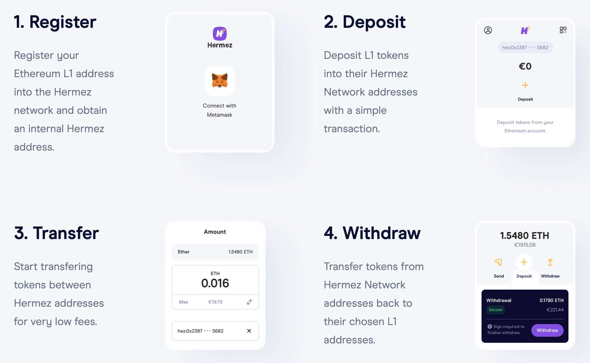

# End User FAQ
&nbsp;
&nbsp;

## Overview & Getting Started 

### What exactly is Hermez?

Hermez is a Layer 2 solution to scale payments on top of Ethereum.  It works by grouping transactions together to create SNARKs - succinct non-interactive arguments of knowledge.  These SNARKs then get settled on the Ethereum base layer, Layer 1, as one transaction. The transactions are executed by Coordinators (our version of block producers).  This means they are effectively running the network by computing the zero-knowledge proof-of-validity for the transactions made by users.  The result is low-cost token transfers, with all the security of Ethereum.  

### How do I set up my Hermez Wallet? 

From a desktop computer, please visit the <a href="https://hermez.io/wallet/"> Hermez Wallet </a> landing page and follow the instructions for setup. 

>Note : To withdraw funds, first select the token you want to withdraw from, and the next screen will show a Withdraw button.

&nbsp;
&nbsp;

## Transactions

### How long do transfers take on Hermez Network from start to finish? 

We expect that transaction time should be between 45 seconds and 30 minutes. There are several factors that can effect the transaction time, including; coordinator configuration, backlogged transactions and the transaction type. Deposits and Withdrawals take place on both L2 (Hermez) and L1 (Ethereum), which can cause an increase in transaction time depending on L1 volume.  

### Who can I transact with on Hermez Network? 

For transfers on Hermez, both the sender and receiver must be on L2. However, the sender may transfer funds to a receiver who has not yet created an account on Hermez L2 as long as the receiver has opened the Hermez Wallet app with their Metamask account.  

### When I send my funds to Hermez on Layer 2, how secure is it?  

It is as secure as it would be on the Layer 1, Ethereum blockchain. Hermez has completed two security audits before launching the mainnet to ensure network security.   
For more information on Hermez security please visit, https://docs.hermez.io/#/about/security

### I'm getting an error message when I try to finalise my withdrawal, what's going on?

The most common reason for this error message is that there are not enough funds in your Ethereum L1 account to complete the withdrawal.  

Withdrawals take place first on the Hermez L2, where the fee is paid in the same token as the transaction.  Next, it needs to move back to L1 which requires "gas" to cover the L1 transaction fee (this amount is determined by current prices on Ethereum Network. Hermez has no control over this fee).  If your L1 Ethereum account does not have enough funds to cover the gas charge, then the withdrawal cannot be completed and will produce the error message.  

To remedy this, please make sure you have enough funds in your L1 Ethereum account to cover the gas to complete the withdrawal.

### My withdrawal is stuck in the last step
The last step of the withdrawal transfers the funds from the smart contract to the user's account. If the gas price suddenly increases, the recommended gas price from Metamask will be too low and the transaction will be stuck in Ethereum transaction pool. You can go to Metamask and speed up the transaction by setting a higher gas price.

### Why is my Deposit taking so long to process?

Deposits move funds from Ethereum  L1 to L2 (Hermez) and must be forged by the Coordinator.  Depending on where the Coordinator is in the forging process, deposits may be as fast as 45 seconds or could take up to 15 minutes maximum. 

### Can I use my Ledger/Trezor hardware with my Hermez Wallet?

Currently, hardware wallets are not supported on Hermez but should be supported in the near future. 

### Can Coordinators take my money?

In short, no.  Coordinators are the Hermez batch producer, they are responsible for running the network. In exchange for their work, they collect all transaction fees in the batch. 

### Can coordinators censor transactions?

Coordinators can decide which transactions they select to include in the batch to forge. In the case that a Coordinator censures a transaction, users have the option to force Coordinators to include their transaction.

&nbsp;
&nbsp;

## Fees and Tokens

### What is the HEZ token? 
HEZ is an ERC-20 utility token used to place bids in the Coordinator auction.

### Who makes money from the transaction fees?

Transaction fees are collected by the Coordinator who placed the highest bid in the Coordinator auction.

### How much will transactions cost on Hermez?

Fees are used to pay for the infrastructure required to maintain the Hermez Coordinator plus the L1 costs involved in forging a new batch of transactions. The cost of the transaction will be split among the hundreds (or even thousands) of transactions in the batch, resulting in a lower cost compared to L1.

### How are transaction fees paid by users?

Transaction fees are paid in the same token of the transaction.

### How much will a new Hermez account cost?

Creating a new Hermez account involves an L1 transaction or an L2 transaction. L1 transactions need to pay for gas, and L2 transactions need to pay the Coordinator fees.

### Which tokens can I use on Hermez Network?

For the current list of tokens registered in Hermez Network please visit: https://explorer.hermez.io/tokens

### Why is the gas fee so high? I thought Hermez was supposed to lower the cost of transactions.

The "gas" fee is charged to move funds from L2 back to Ethereum mainnet (L1). It is determined by current prices on the Ethereum Network and Hermez has no control over this fee.

### Do I need HEZ tokens to use the Hermez Network?

There's no need for HEZ tokens on the user side to send transactions as fees are paid in the same token of the transaction.
For a list of the current tokens registered in Hermez please visit: https://explorer.hermez.io/tokens

&nbsp;
&nbsp;

## Troubleshooting 

### Where can I submit a bug report or contact Hermez for additional help?

First, look over these FAQs to see if your question has been properly addressed already. In addition, you can always report bugs to hello@hermez.network or contact us in [Discord](https://bit.ly/hermez-discord). Another source of information is the [Hermez documentation page](https://docs.hermez.io)

