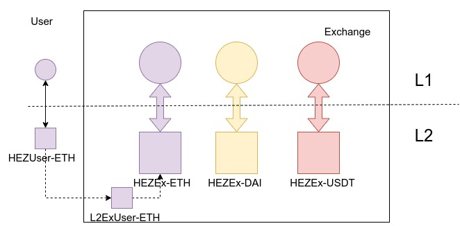

# Exchanges

This example shows a possible flow of how an exchange would use Hermez. This example requires npm version `1.0.0-beta.15` or later of `@hermeznetwork/hermezjs` SDK.
To get a complete tutorial on other functionalities, check out the SDK [documentation](../developers/sdk.md)

## Pre-requisites
-  Exchange already has some Hermez accounts for each trading token (`HEZEx-ETH`, `HEZEx-DAI`,...). 
-  User has a Hermez account (`HEZUser-ETH`)


Both exchange and user pre-existing accounts are regular Hermez accounts, consisting of an L2 account linked to an Ethereum account where funds can be withdrawn.
The following is an example of code used to initialize hermezjs with `Hermez testnet` deployment and create both user and exchange accounts. You need to supply your
own WEB3_URL (Ethereum Node URL) and two Rinkeby Ethereum Private Keys.

Note that the latest smart contract addresses can always be found [here](https://api.testnet.hermez.io/v1/config)

```js
const hermez = require("@hermeznetwork/hermezjs");

const EXAMPLES_HERMEZ_API_URL = "https://api.testnet.hermez.io/v1";
const EXAMPLES_HERMEZ_ROLLUP_ADDRESS = "0x679b11E0229959C1D3D27C9d20529E4C5DF7997c";
const EXAMPLES_HERMEZ_WDELAYER_ADDRESS = "0xeFD96CFBaF1B0Dd24d3882B0D6b8D95F85634724";

// Provide your own values
const EXAMPLES_WEB3_URL = "http://----";
const EXAMPLES_PRIVATE_KEY1 = "0x----";
const EXAMPLES_PRIVATE_KEY2 = "0x----";

async function sleep (timeout) {
  await new Promise(resolve => setTimeout(resolve, timeout));
}

function configureEnvironment () {
  // Initializes Tx Pool
  hermez.TxPool.initializeTransactionPool()
  // load ethereum network provider
  hermez.Providers.setProvider(EXAMPLES_WEB3_URL)

  // set environment
  hermez.Environment.setEnvironment({
    baseApiUrl: EXAMPLES_HERMEZ_API_URL,
    contractAddresses: {
      [hermez.Constants.ContractNames.Hermez]: EXAMPLES_HERMEZ_ROLLUP_ADDRESS,
      [hermez.Constants.ContractNames.WithdrawalDelayer]: EXAMPLES_HERMEZ_WDELAYER_ADDRESS
    }
  })
}

async function main(){
  // INITIALIZATION
  // initialize hermezjs and prepare two Hermez accounts with some ETH (user and exchange accounts)
  configureEnvironment()

  const exchangePrivKey = EXAMPLES_PRIVATE_KEY1;
  const userPrivKey = EXAMPLES_PRIVATE_KEY2;

  // load token to deposit information
  const tokenEthIndex = 0;
  const token = await hermez.CoordinatorAPI.getTokens();
  const tokenETH = token.tokens[tokenEthIndex];

  // load first account
  const wallet = await hermez.HermezWallet.createWalletFromEtherAccount(EXAMPLES_WEB3_URL, { type: "WALLET", privateKey: exchangePrivKey });
  const hermezExchangeWallet = wallet.hermezWallet;
  const hermezExchangeEthereumAddress = wallet.hermezEthereumAddress;

  // load second account
  const wallet2 = await hermez.HermezWallet.createWalletFromEtherAccount(EXAMPLES_WEB3_URL, { type: "WALLET", privateKey: userPrivKey });
  const hermezUserWallet = wallet2.hermezWallet;
  const hermezUserEthereumAddress = wallet2.hermezEthereumAddress;
  console.log("W2", wallet2)

  // set amount to deposit
  const amountDeposit = hermez.Utils.getTokenAmountBigInt("0.1", 18);
  const compressedDepositAmount = hermez.HermezCompressedAmount.compressAmount(amountDeposit);

  // perform deposit hermezExchangeAccount
  await hermez.Tx.deposit(
    compressedDepositAmount,
    hermezExchangeEthereumAddress,
    tokenETH,
    hermezExchangeWallet.publicKeyCompressedHex,
    { type: "WALLET", privateKey: exchangePrivKey }
  );

  // perform deposit hermezUserAccount
  await hermez.Tx.deposit(
    compressedDepositAmount,
    hermezUserEthereumAddress,
    tokenETH,
    hermezUserWallet.publicKeyCompressedHex,
    { type: "WALLET", privateKey: userPrivKey }
  );

  // WAIT until accounts are created
  const pollingAccountCreate = true;
  while (pollingAccountCreate){
    const accountExchangeInfo = await hermez.CoordinatorAPI.getAccounts(hermezExchangeEthereumAddress, [tokenETH.id]);
    if (accountExchangeInfo.accounts.length === 0){
      console.log("Waiting for deposits to be forged...");
      await sleep(10000);
    } else {
      console.log("Accounts created", accountExchangeInfo)
      break;
    }
  }

  const infoAccountExchange = (await hermez.CoordinatorAPI.getAccounts(hermezExchangeWallet.hermezEthereumAddress, [tokenETH.id]))
    .accounts[0];
  console.log(infoAccountExchange);

}

main();
```

## Deposit to Exchange
A User wants to transfer 10 ETH from his Hermez account to the exchange for the first time. To do so, the user requests to transfer some funds via some sort of front end provided by the exchange.
After the request is done, the exchange provides the address of an internal Hermez account where the user can deposit his tokens. This account doesn't have an Ethereum counterpart account, 
and thus the creation is very inexpensive. Once the user has received the L2 account address, he can perform the transfer normally.
In the meantime, the exchange is monitoring the status of this account, and once the user transfer is completed, the exchange can transfer the funds to its main account. This process is depicted in the diagram below.

The creation of this user account by the exchange needs to only done once per user and token.



### Flow 
1. User requests to do a transfer to the exchange from his Hermez account using some front-end.
2. Exchange creates an L2 (internal) account on behalf of the user (`L2ExUser-ETH`) and provides the address via front-end. This account is controlled by the exchange. 
```js
  // create rollup internal account from bjj private key
  const resExchangeWallet = await hermez.HermezWallet.createWalletFromBjjPvtKey();
  const hermezExchangeUserWallet = resExchangeWallet.hermezWallet;

  // share public bjj key with the user
  console.log(`Transfer funds to this hermez address:\n   ${hermezExchangeUserWallet.publicKeyBase64}\n\n`); 
```
3. User does a L2 transfer from his account to the destination account using the web wallet
```js
  const infoAccountUser = (await hermez.CoordinatorAPI.getAccounts(hermezUserWallet.hermezEthereumAddress, [tokenETH.id]))
    .accounts[0];

  const state = await hermez.CoordinatorAPI.getState();
  const usdTokenExchangeRate = tokenETH.USD;
  const fee = usdTokenExchangeRate ? state.recommendedFee.createAccountInternal / usdTokenExchangeRate : 0;

  // user creates transaction to deposit 10 ether into exchange account
  // deposit 10 ether
  const userDepositToExchange = hermez.Utils.getTokenAmountBigInt("10.0", 18);
  const compressedUserDepositToExchange = hermez.HermezCompressedAmount.compressAmount(userDepositToExchange);
  // the following transaction would:
  // - create an account for the exchange in hermez network
  // - transfer to exchange account 0.1 eth
  const transferToExchange = {
    from: infoAccountUser.accountIndex,
    to: hermezExchangeUserWallet.publicKeyBase64,
    amount: compressedUserDepositToExchange,
    fee : fee
  };
  console.log("transferToExchange: ", transferToExchange, fee);
  // send tx to hermez network
  await hermez.Tx.generateAndSendL2Tx(transferToExchange, hermezUserWallet, tokenETH);
```
4. Exchange monitors balance of the account `L2ExUser-ETH`, and once transfer is complete, exchange performs transfer from `L2ExUser-ETH` to `L2Ex-ETH` for 10 ETH.
```js
  const pollingExchangeAddr = true;
  while (pollingExchangeAddr){
    const accountExchangeInfo = await hermez.CoordinatorAPI.getAccounts(hermezExchangeUserWallet.publicKeyBase64, [tokenETH.id]);
    if (accountExchangeInfo.accounts.length === 0){
      console.log("Waiting for user deposit to be forged...");
      await sleep(10000);
    } else {
      console.log("<=== Received deposit from user ===>");
      console.log(`accountExchangeInfo:\n ${accountExchangeInfo.accounts[0]}`);
      break;
    }
  }

  const infoAccountExchangeUser = (await hermez.CoordinatorAPI.getAccounts(hermezExchangeUserWallet.publicKeyBase64, [tokenETH.id]))
   .accounts[0];

  // Transfer funds to main exchange account
  // generate L2 transaction
  const l2TxTransfer = {
    from: infoAccountExchangeUser.accountIndex,
    to:  infoAccountExchange.accountIndex,
    amount: compressedUserDepositToExchange,
    fee: fee
  };

  const transferResponse = await hermez.Tx.generateAndSendL2Tx(l2TxTransfer, hermezExchangeUserWallet, tokenETH).catch(console.log);
  console.log("transferResponse: ", transferResponse);
```

### Full Example
```js
const hermez = require("@hermeznetwork/hermezjs");

const EXAMPLES_HERMEZ_API_URL = "https://api.testnet.hermez.io/v1";
const EXAMPLES_HERMEZ_ROLLUP_ADDRESS = "0x14a3b6f3328766c7421034e14472f5c14c5ba090";
const EXAMPLES_HERMEZ_WDELAYER_ADDRESS = "0x6ea0abf3ef52d24427043cad3ec26aa4f2c8e8fd";

// Provide your own values
const EXAMPLES_WEB3_URL = "http://----";
const EXAMPLES_PRIVATE_KEY1 = "0x----";
const EXAMPLES_PRIVATE_KEY2 = "0x----";

async function sleep (timeout) {
  await new Promise(resolve => setTimeout(resolve, timeout));
}

function configureEnvironment () {
  // Initializes Tx Pool
  hermez.TxPool.initializeTransactionPool()
  // load ethereum network provider
  hermez.Providers.setProvider(EXAMPLES_WEB3_URL)

  // set environment
  hermez.Environment.setEnvironment({
    baseApiUrl: EXAMPLES_HERMEZ_API_URL,
    contractAddresses: {
      [hermez.Constants.ContractNames.Hermez]: EXAMPLES_HERMEZ_ROLLUP_ADDRESS,
      [hermez.Constants.ContractNames.WithdrawalDelayer]: EXAMPLES_HERMEZ_WDELAYER_ADDRESS
    }
  })
}

async function main(){
  // INITIALIZATION
  // initialize hermezjs and prepare two Hermez accounts with some ETH (user and exchange accounts)

  configureEnvironment()

  const exchangePrivKey = EXAMPLES_PRIVATE_KEY1;
  const userPrivKey = EXAMPLES_PRIVATE_KEY2;

  // load token to deposit information
  const tokenEthIndex = 0;
  const token = await hermez.CoordinatorAPI.getTokens();
  const tokenETH = token.tokens[tokenEthIndex];

  // load first account
  const wallet = await hermez.HermezWallet.createWalletFromEtherAccount(EXAMPLES_WEB3_URL, { type: "WALLET", privateKey: exchangePrivKey });
  const hermezExchangeWallet = wallet.hermezWallet;
  const hermezExchangeEthereumAddress = wallet.hermezEthereumAddress;

  // load second account
  const wallet2 = await hermez.HermezWallet.createWalletFromEtherAccount(EXAMPLES_WEB3_URL, { type: "WALLET", privateKey: userPrivKey });
  const hermezUserWallet = wallet2.hermezWallet;
  const hermezUserEthereumAddress = wallet2.hermezEthereumAddress;

  // set amount to deposit
  const amountDeposit = hermez.Utils.getTokenAmountBigInt("0.1", 18);
  const compressedDepositAmount = hermez.HermezCompressedAmount.compressAmount(amountDeposit);

  // perform deposit hermezExchangeAccount
  await hermez.Tx.deposit(
    compressedDepositAmount,
    hermezExchangeEthereumAddress,
    tokenETH,
    hermezExchangeWallet.publicKeyCompressedHex,
    { type: "WALLET", privateKey: exchangePrivKey }
  );

  // perform deposit hermezUserAccount
  await hermez.Tx.deposit(
    compressedDepositAmount,
    hermezUserEthereumAddress,
    tokenETH,
    hermezUserWallet.publicKeyCompressedHex,
    { type: "WALLET", privateKey: userPrivKey }
  );

  console.log("Deposits")
  // WAIT until accounts are created
  const pollingAccountCreate = true;
  while (pollingAccountCreate){
    const accountExchangeInfo = await hermez.CoordinatorAPI.getAccounts(hermezExchangeEthereumAddress, [tokenETH.id]);
    if (accountExchangeInfo.accounts.length === 0){
      console.log("Waiting for deposits to be forged...");
      await sleep(10000);
    } else {
      console.log("Accounts created", accountExchangeInfo)
      break;
    }
  }

  const infoAccountExchange = (await hermez.CoordinatorAPI.getAccounts(hermezExchangeWallet.hermezEthereumAddress, [tokenETH.id]))
    .accounts[0];

  // EXCHANGE ACTION
  // create rollup internal account from bjj private key
  const resExchangeWallet = await hermez.HermezWallet.createWalletFromBjjPvtKey();
  const hermezExchangeUserWallet = resExchangeWallet.hermezWallet;

  // share public bjj key with the user
  console.log(`Transfer funds to this hermez address:\n   ${hermezExchangeUserWallet.publicKeyBase64}\n\n`);

  // USER ACTION
  // - the following code could be done through the web wallet provided by hermez network
  // - it is assumed that the user has already Ether in Hermez Network
  
  const infoAccountUser = (await hermez.CoordinatorAPI.getAccounts(hermezUserWallet.hermezEthereumAddress, [tokenETH.id]))
    .accounts[0];

  const state = await hermez.CoordinatorAPI.getState();
  const usdTokenExchangeRate = tokenETH.USD;
  const fee = usdTokenExchangeRate ? state.recommendedFee.createAccountInternal / usdTokenExchangeRate : 0;

  // user creates transaction to deposit some ether into exchange account
  const userDepositToExchange = hermez.Utils.getTokenAmountBigInt("0.0001", 18);
  const compressedUserDepositToExchange = hermez.HermezCompressedAmount.compressAmount(userDepositToExchange);
  // the following transaction would:
  // - create an account for the exchange in hermez network
  const transferToExchange = {
    from: infoAccountUser.accountIndex,
    to: hermezExchangeUserWallet.publicKeyBase64,
    amount: compressedUserDepositToExchange,
    fee : fee
  };
  console.log("transferToExchange: ", transferToExchange, fee);
  // send tx to hermez network
  await hermez.Tx.generateAndSendL2Tx(transferToExchange, hermezUserWallet, tokenETH);

  // EXCHANGE ACTION
  // polling exchange account to check deposit from user is received
  const pollingExchangeAddr = true;
  while (pollingExchangeAddr){
    const accountExchangeInfo = await hermez.CoordinatorAPI.getAccounts(hermezExchangeUserWallet.publicKeyBase64, [tokenETH.id]);
    if (accountExchangeInfo.accounts.length === 0){
      console.log("Waiting for user deposit to be forged...");
      await sleep(10000);
    } else {
      console.log("<=== Received deposit from user ===>");
      console.log("accountExchangeInfo:\n", accountExchangeInfo.accounts[0]);
      break;
    }
  }
  const infoAccountExchangeUser = (await hermez.CoordinatorAPI.getAccounts(hermezExchangeUserWallet.publicKeyBase64, [tokenETH.id]))
   .accounts[0];

  // Transfer funds to main exchange account
  // generate L2 transaction
  const l2TxTransfer = {
    from: infoAccountExchangeUser.accountIndex,
    to:  infoAccountExchange.accountIndex,
    amount: compressedUserDepositToExchange,
    fee: fee
  };

  const transferResponse = await hermez.Tx.generateAndSendL2Tx(l2TxTransfer, hermezExchangeUserWallet, tokenETH).catch(console.log);
  console.log("transferResponse: ", transferResponse);
}

main();
```
