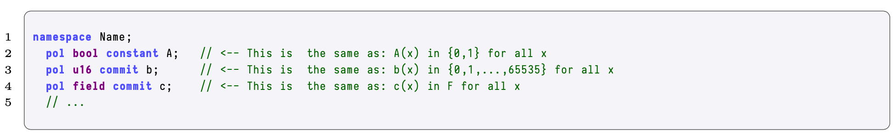
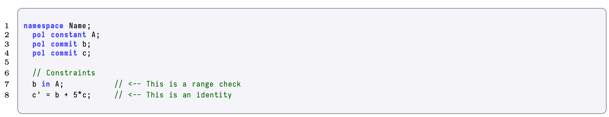
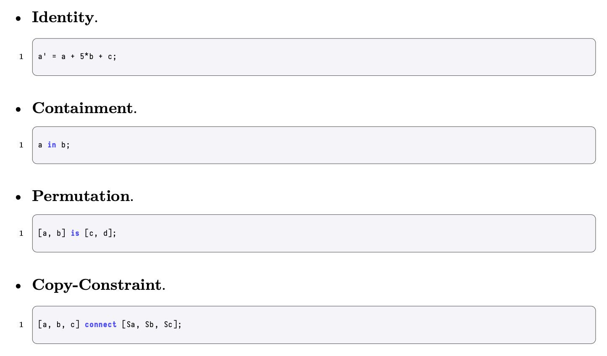

The aim with this section is to explain most of the PIL components in-depth.

## Namespaces

<b> Code Excerpt 6: PIL Namespace File </b>

State machines in PIL are organized in _namespaces_. Namespaces are written with the keyword $\texttt{namespace}$ followed by the name of the state machine, and they can optionally include other parameters. In the previous snippet, a state machine called $\texttt{Name}$ is created.

The namespace keyword opens a workspace for the developer to englobe all the polynomials and identities of a single state machine. Every component of a state machine is included within its namespace. There is a one-to-one correspondence between state machine and namespaces.

The same name cannot be used twice between state machines that are directly or indirectly related, since this would cause an overlap in the lookup arguments and the compiler would not be able to decide.

So, for instance the following two examples are not allowed,

<b> Code Excerpt 7: PIL No Common Names </b>

## Polynomials

<b> Code Excerpt 8: PIL Constant and Committed Polynomials </b>

_Polynomials_ are the key component of PIL. Values of polynomials have to be compared with computational trace's columns. In fact, in PIL, the two are considered to be the same thing. More precisely, polynomials are just the interpolation of the columns over all the rows of the computational trace.

Every polynomial is prefixed with the keyword $\texttt{pol}$ and needs to be explicitly set to be either a constant (also known as _preprocessed_) or committed. Polynomials fall into these two categories depending on the origin of their creation or how they are going to be used. Consequently, in PIL there exist two keywords to denote the two types of polynomials: $\texttt{constant}$ and $\texttt{commit}$.

### Constant Polynomials

<b> Code Excerpt 9: A Constant in PIL </b>

_Constant polynomials_, also known in the literature as _preprocessed polynomials_, are polynomials known prior to the execution of the state machine. They correspond to polynomials that do not change during the execution, and are known to both the prover $\mathcal{P}$ and the verifier $\mathcal{V}$ prior to execution. They can be thought of as the preprocessed polynomials of an arithmetic circuit.

A typical use of these polynomials is in the inclusion of selectors, latches and sequencers. A constant polynomial is created or initialize as a polynomial with the keyword $\texttt{constant}$. And it is typically written in uppercase. This is good practice as it helps to differentiate them from the committed ones.

### Committed Polynomials

<b> Code Excerpt 9: A Constant in PIL </b>

Committed polynomials are _not_ known prior to the execution of the state machine. They are analogous to variables because their values change during execution, and are _only_ known to the prover $\mathcal{P}$. In order to create a committed polynomial, simply prefix the polynomial in question with the keyword $\texttt{committed}$ (in the same way a variable-type is declared in standard programming languages).

These polynomials are typically divided between _input polynomials_ and _state variables_. Although they are instantiated in the usual way, their purpose is completely different in the PIL context.

**Free Input Polynomials**

Free input polynomials are used to introduce data to the state machines. Each individual state machine applies its specific logic over the data introduced by these polynomials when executing computations. The data is considered the output of some state transition (or the output of the state machine, if it is the last transition). Also, free input polynomials are introduced by the prover, yet they are unknown to the verifier. They are therefore labelled, and prefixed, as $\texttt{committed}$.

**State Variables**

State variables are a set of values considered to be the state of the state machine. These polynomials play a pivotal role in the state machines, which is to help the prover focus on the correct evolution of the state variables during the generation of a proof.

The output of the computation in each state transition is included in the state variables. The state of the state variables in the last transition is the $\textit{output}$ of the computation.

State variables depend on the input and the constant polynomials. They are also therefore labelled as committed.

## Polynomial Element Types

<b> Code Excerpt 10: Types of Polynomial Element </b>

A polynomial definition can also contain a keyword indicating the type of elements a polynomial is composed of. Types include, for instance, $\texttt{bool}$, $\texttt{u16}$, $\texttt{field}$.

The type is strictly informative. This means that to enforce the elements of some polynomial to be restricted over some smaller domain, one should include a constraint reflecting the bounds.

## Constraints

The set of _constraints_ is one of the most important part of a PIL code. The constraints are defined to be the set of relations between polynomials that dictate the correct evolution of the state machine at every step. A state machine does what it does because the set of constraints enforces such a behavior.

<b> Code Excerpt 11: Polynomial Constraints </b>

Constraints can generally be of the following types (to be changed),

<b> Code Excerpt 12: The Main Polynomial Constraints </b>

