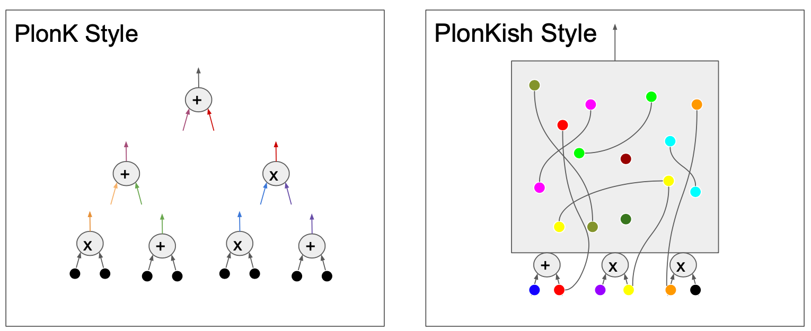
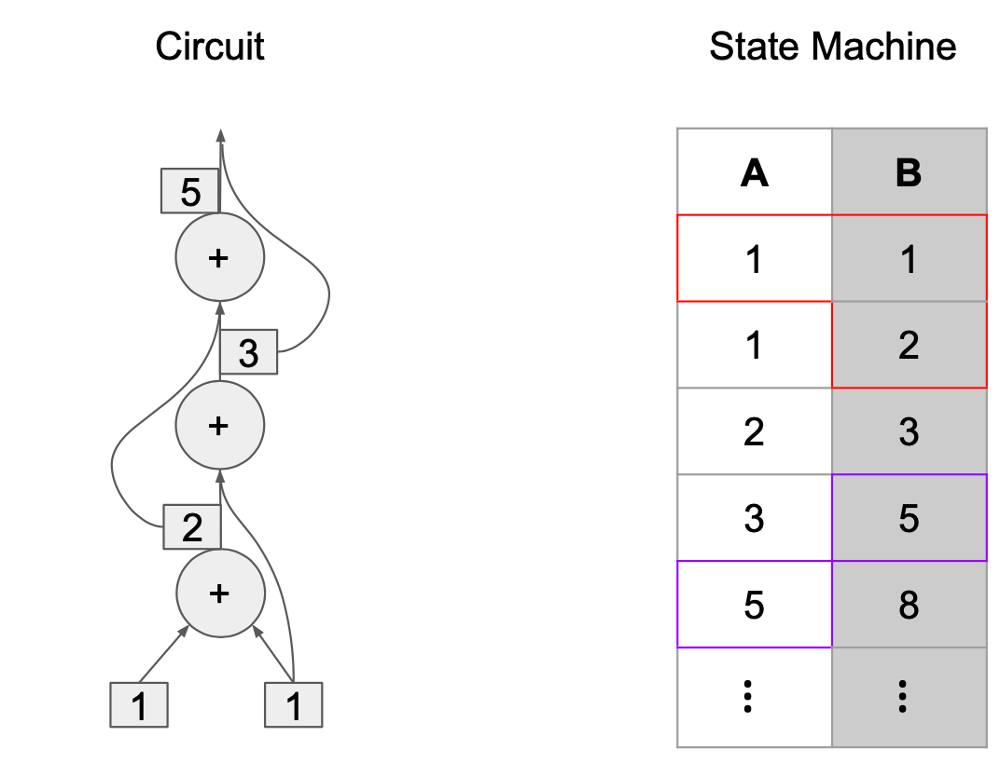

_Polynomial Identity Language (PIL)_ is a novel domain-specific language useful for defining state machines. The aim for creating PIL is to provide developers a holistic framework for both constructing state machines through an easy-to-use interface, and abstracting the complexity of the proving mechanisms. One of the main peculiarities of PIL is its _modularity_, which allows programmers to define parametrizable state machines, called _namespaces_, which can be instantiated from larger state machines. Building state machines in a modular manner makes it easier to test, review, audit and formally verify even large and complex state machines. In this regard, by using PIL, developers can create their own custom namespaces or instantiate namespaces from some public library.

Some of the keys features of PIL are;

- Providing $\texttt{namespaces}$ for naming the essential parts that constitutes state machines.
- Denoting whether the polynomials are $\texttt{committed}$ or $\texttt{constant}$.
- Expressing polynomial relations, including $\texttt{identities}$ and $\texttt{lookup arguments}$.
- Specifying the type of a polynomial, such as $\texttt{bool}$ or $\texttt{u32}$.

## State Machines: The Computational Model Behind PIL

Many other domain-specific languages (DSL) or toolstacks, such as [Circom](https://docs.circom.io/) or [Halo2](https://zcash.github.io/halo2/), focus on the abstraction of a particular computational model, such as an arithmetic circuit.

Arithmetic circuits arise naturally in the context of succinct interactive protocols and are therefore an appropriate representation in the context of PIL.

Arithmetic circuits are covered by developer tools generally in two ways, either in the vanilla PlonK Style or the PlonKish Style. See Figure 1 for a high-level description of these two styles and how they differ.

<b> Figure 1: Vanilla PlonK vs PlonKish Circuit Representation Style </b>

However, recent proof systems such as STARKs have shown that arithmetic circuits might not be the best computational models in all use-cases. Given a complete programming language, computing a valid proof for a circuit satisfiability problem, may result in long proving times due to the overhead of re-used logic. Opting for deployment of state machines, with their low-level programming, shorter proving times are attainable especially with the advent of proof/verification-aiding languages such as PIL.

Figure 2 below, provides a high-level description of a state machine architecture. A typical state machine takes some input and produces the corresponding output, according to the Arithmetic-Logic Unit (ALU). This ALU is the very core of the state machine as it determines the internal state of the state machine, as well as the values of its output.

<b> Figure 2: Architectural view of a State Machine </b>

Figure 3 and 4 show the comparison between the design of circuits and state machines in various natural scenarios. The former makes a comparison in the case of a program with a looping nature, and the latter shows a program with a branching nature.

<b> Figure 3: Circuit and state machine comparison in a loop-based computation </b>

<b> Figure 4: Circuit and State Machine comparison in a branch-based computation </b>

