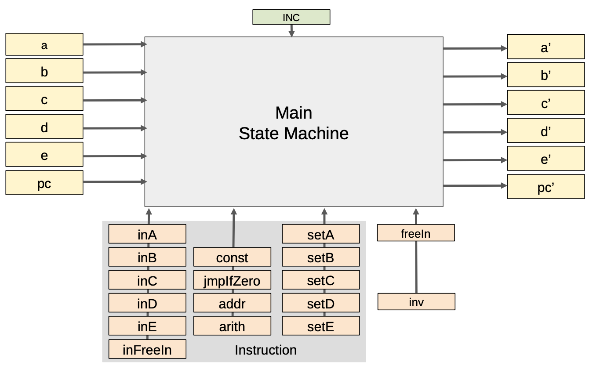
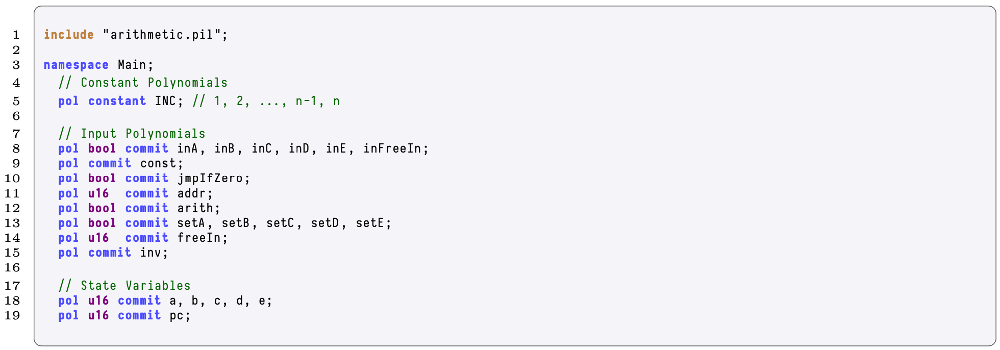
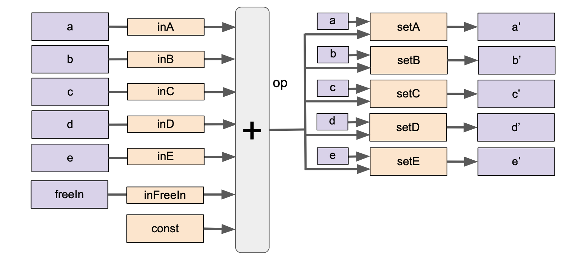
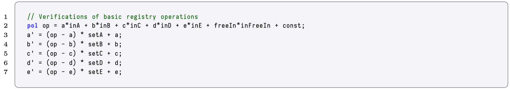
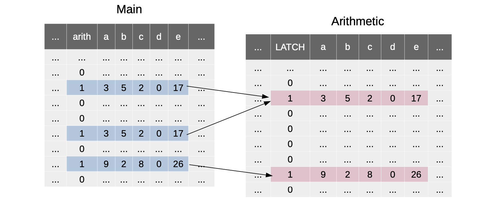

Although several polynomials could be added to the above state machine so as to express more operations, it would only make the design hard to test, audit or formally verify.

In order to avoid this complication, PIL lets one use a divide and conquer technique:

(a) Instead of developing one (big) state machine, a typical architecture consists of different state machines.

(b) Each state machine is devoted to proving the execution of a specific task, each with its own set of constraints.

(c) Then, relevant polynomials on different state machines are related and compared using lookup tables or permutation arguments.

(d) This guarantees consistency as if it would have been a single state machine.

PIL is therefore best suited for a modular design of state machines.

Figure 12 depicts a connection between the polynomials $[a,b,c]$ and $[d,e,f]$.

<b> Figure 12: Polynomial Connections Across State Machines </b>

To illustrate this process,

1. First, design a state machine to manage arithmetic operations over $2$-byte elements.
2. Then, connect this state machine with another state machine (that needs to perform arithmetic operations) via a lookup argument.

### The Arithmetic State Machine

The _Arithmetic State Machine_ is in charge of checking that some arithmetic operations like additions and multiplications are correctly performed over $2$-byte elements. For this, the polynomials; $\texttt{a}$, $\texttt{b}$, $\texttt{c}$, $\texttt{d}$, and $\texttt{e}$; must satisfy the identity:

$$
\texttt{a}(X) \cdot \texttt{b}(X) + \texttt{c}(X) = 2^{16} \cdot \texttt{d}(X) + \texttt{e}(X).
$$

Notice the following,

(a) The multiplication between $\texttt{a}$ and $\texttt{b}$, which are $2$-byte elements, can be expressed with $\texttt{e}$ and $\texttt{d}$, where these are also $2$-byte elements.

(b) Enforce that all the evaluations of $\texttt{a}$, $\texttt{b}$, $\texttt{c}$, $\texttt{d}$ and $\texttt{e}$ are $2$-byte elements.

<b> Figure 13: Architecture of the Arithmetic State Machine </b>

Figure 13 shows how the Arithmetic State Machine is designed. And, Tableb14 displays an example of how the computational trace looks like.

<b> Table 14: Computational Trace of the Arithmetic State Machine </b>

The Arithmetic state machine works as follows. $\texttt{LATCH}$ is used to flag when the operation is ready. Note that $\texttt{SET}[A]$, $\texttt{SET}[B]$, $\texttt{SET}[C]$, $\texttt{SET}[D]$, $\texttt{SET}[E]$ and $\texttt{LATCH}$ are constant polynomials. $\texttt{freeIn}$ is committed, and contains the values on which arithmetic operations are performed. Polynomials $\texttt{a}$, $\texttt{b}$, $\texttt{c}$, $\texttt{d}$ and $\texttt{e}$ compose the state variables.

The polynomial identities that define the Arithmetic State Machine are as follows:

$$
\begin{aligned}
&\texttt{freeIn} \subset [0,2^{16} - 1], \\
\texttt{a}' &= \texttt{SET}[A]\cdot(\texttt{freeIn} - \texttt{a}) + \texttt{a}, \\
\texttt{b}' &= \texttt{SET}[B]\cdot(\texttt{freeIn} - \texttt{b}) + \texttt{b}, \\
\texttt{c}' &= \texttt{SET}[C]\cdot(\texttt{freeIn} - \texttt{c}) + \texttt{c}, \\
\texttt{d}' &= \texttt{SET}[D]\cdot(\texttt{freeIn} - \texttt{d}) + \texttt{d}, \\
\texttt{e}' &= \texttt{SET}[E]\cdot(\texttt{freeIn} - \texttt{e}) + \texttt{e}, \\
0 &= [ \texttt{a} \cdot \texttt{b} + \texttt{c} - (2^{16} \cdot \texttt{d} + \texttt{e}) ] \cdot \texttt{LATCH}.
\end{aligned}
$$

These are included in PIL as shown in the code excerpt below.

<b> Code Excerpt 15: PIL Example </b>

### The Main State Machine

The _Main State Machine_ is in charge of some (major) tasks, but will specifically use the Arithmetic SM when Arithmetic operations needs to be performed over certain values.

<b> Figure 15: The Main State Machine Architecture </b>

Hence, the first task in PIL is to introduce the various polynomials. It looks as follows,

<b> Code Excerpt 15: Arithmetic State Machine PIL Example </b>

 are of the )if some polynomial is intended to be boolean, then a constraint that reflects so must be added.

<b> Code Excerpt 16: PIL Example with Added Constraint </b>

Now, add various constraints regarding the evolution of the "main" state variables $a$, $b$, $c$, $d$ and $e$, so that any kind of linear combination between the main state variables, the free input and any constant is subject to be moved in the next iteration of some (or all) the state variables. Figure 16 shows a diagram of the desired behavior.

<b> Figure 16: Boolean Polynommials in the Main State Machine </b>

In PIL, it translates to the following:

<b> Code Excerpt 17: Verification of Basic Registry Operations </b>

Finally, the constraints reflecting the relationship between the Main and the Arithmetic SMs can be checked.

<b> Code Excerpt 18: PIL Example Connect Main and Arithmetic SMs </b>

The connections can be depicted in terms of tables, as Figure 17 below,

<b> Figure 17: Connecting Arithmetic and Main State Machines </b>

On the one side, the $\texttt{arith}$ selector is used in the Main SM to point to this state machine when an arithmetic lookup have to be performed. On the other side, the $\texttt{LATCH}$ selector, which also works as a selector for which rows should be added in the lookup argument is used. And, as illustrated in Figure 17 above, this proves that,

\begin{array}{c}
\texttt{Main.arith} \cdot [\texttt{Main.a} , \texttt{Main.b} , \texttt{Main.c} , \texttt{Main.d}, \texttt{Main.e}] \\ \subset \\ \texttt{Arith.LATCH} \cdot [\texttt{Arith.a}, \texttt{Arith.b}, \texttt{Arith.c}, \texttt{Arith.d}, \texttt{Arith.e}].
\end{array}
