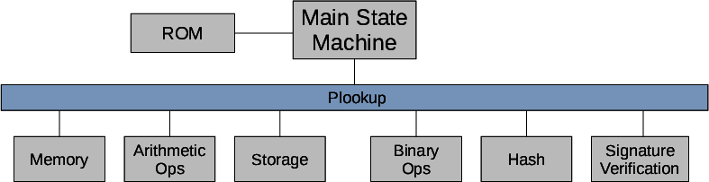

## Divide and Conquer

We want now to extend the previous idea to a more complex machine that can handle, for example, multiplications. 

We could keep adding columns to our state machine to express such operations but that would make the design complex and hard to handle. Instead, we are going to use a divide and conquer technique:

-   Our zk-EVM architecture comprises different connected state machines.

-   Each state machine is devoted to proving the execution of a specific task.

-   Then, relevant columns (polynomials) of these different state machines are related using inclusion proofs (with plookup).

To illustrate this important process:

-   Let's design a state machine to manage arithmetic operations with elements of 32 bits.

-   Then, let's connect this state machine to our main state machine with an inclusion proof.

## Arithmetic State Machine

The arithmetic state machine will check sums, subtractions, multiplications and divisions with elements of 32 bits.

For this, we use the following constraint with five registries:
$$
\mathcal{A}_i \cdot \mathcal{B}_i + \mathcal{C}_i = 2^{32} \mathcal{D}_i + \mathcal{E}_i.
$$

Notice that the multiplication between $\mathcal{A}_i$ and $\mathcal{B}_i$, which are elements of 32 bits, can be expressed with $\mathcal{E}_i$ and $\mathcal{D}_i$ where these are also elements of 32 bits. The $\mathcal{D_i}$ term carries the exceeding part of the multiplication.

As before, we will express the previous relation as a cyclic polynomial identity at some subgroup $H$ of roots of unity of $\mathbb{Z}_{p}$:

$$
\mathcal{A}(x) \cdot \mathcal{B}(x) + \mathcal{C}(x) = 2^{32} \mathcal{D}(x) + \mathcal{E}(x). 
$$

Notice also that we have to enforce that all the images of $\mathcal{A}(x)$, $\mathcal{B}(x)$, $\mathcal{C}(x)$, $\mathcal{D}(x)$ and $\mathcal{E}(x)$ at $H$ are elements of 32 bits.

We will design a machine to check this kind of operations as follows:

$$
\tiny
\begin{array}{|c|c|c|c|c|c|c|c|c|c|c|c|c|c|c|c|c|}
\hline
 \textbf{set}\mathcal{A} &  \textbf{set}\mathcal{B} 
&  \textbf{set}\mathcal{C} &  \textbf{set}\mathcal{D} &  \textbf{set}\mathcal{E} &  \textbf{latch}
 & \textbf{freeIn} &  \mathcal{A} &  \mathcal{A'} &  \mathcal{B} & \mathcal{B'} & \mathcal{C} & \mathcal{C'} & \mathcal{D} & \mathcal{D'} & \mathcal{E} & \mathcal{E'}\\ \hline
1 & 0 & 0 & 0 & 0 & 0 & 0x0003 & 0 & 0x003 & 0 & 0 & 0 & 0 & 0 & 0 & 0 & 0\\ \hline
0 & 1 & 0 & 0 & 0 & 0 & 0x0002 & 0x0003 & 0x0003 & 0 & 0x0002 & 0 & 0 & 0 & 0 & 0 & 0\\ \hline
0 & 0 & 1 & 0 & 0 & 0 & 0x0004 & 0x0003 & 0x0003 & 0x0002 & 0x0002 & 0 & 0x0004 & 0 & 0 & 0 & 0\\ \hline
0 & 0 & 0 & 1 & 0 & 0 & 0 & 0x0003 & 0x0003 & 0x0002 & 0x0002 & 0x0004 & 0x0004 & 0 & 0 & 0 & 0\\ \hline
0 & 0 & 0 & 0 & 1 & 0 & 0x000a & 0x0003 & 0x0003 & 0x0002 & 0x0002 & 0x0004 & 0x0004 & 0 & 0 & 0 & 0x000a\\ \hline
1 & 0 & 0 & 0 & 0 & \mathbf{1} & 0x1111 &  \mathbf{0x0003} & 0x1111 &  \mathbf{0x0002} & 0x0002 &  \mathbf{0x0004} & 0x0004 &  \mathbf{0} & 0 &  \mathbf{0x000a} & 0x000a\\ \hline
0 & 1 & 0 & 0 & 0 & 0 & 0x2222 & {0x1111} & 0x1111 & {0x0002} & 0x2222 & {0x0004} & 0x0004 & {0} & 0 & {0x000a} & 0x000a\\ \hline
0 & 0 & 1 & 0 & 0 & 0 & 0x3333 & {0x1111} & 0x1111 & {0x2222} & 0x2222 & {0x0004} & 0x3333 & {0} & 0 & {0x000a} & 0x000a\\ \hline
0 & 0 & 0 & 1 & 0 & 0 & 0x0246 & {0x1111} & 0x1111 & {0x2222} & 0x2222 & {0x3333} & 0x3333 & {0} & 0x0246 & {0x000a} & 0x000a\\ \hline
0 & 0 & 0 & 0 & 1 & 0 & 0xb975 & {0x1111} & 0x1111 & {0x2222} & 0x2222 & {0x3333} & 0x3333 & {0x0246} & 0x0246 & {0x000a} & 0xb975\\ 
\hline
1 & 0 & 0 & 0 & 0 &  \mathbf{1} & 0x7777 & \mathbf{0x1111} & 0x7777 & \mathbf{0x2222} & 0x2222 & \mathbf{0x3333} & 0x3333 & \mathbf{0x0246} & 0x0246 & \mathbf{0xb975} & 0xb975\\ \hline
... & ... & ... & ... & ... & ... & ... & ... & ... & ... & ... & ... & ... & ... & ... & ... & ...\\ \hline
\end{array}
$$

Accents are used to denote the next value of the registry. We use **latch** to flag when the operation is ready and there is the need to check the constraint with the actual values of $\mathcal{A}, \mathcal{B}, \mathcal{C}, \mathcal{D}, \mathcal{E}$. Notice that $\textbf{set}\mathcal{A}$, $\textbf{set}\mathcal{B}$, $\textbf{set}\mathcal{C}$, $\textbf{set}\mathcal{D}$, $\textbf{set}\mathcal{E}$ and **latch** are constant (preprocessed), in other words, they do not depend on the input.

The column **freeIn** is committed and contains the values for which we want to do the arithmetic operations. The values of $\mathcal{A}$, $\mathcal{B}$, $\mathcal{C}$, $\mathcal{D}$ and $\mathcal{E}$ depend on the **freeIn** and are obviously also committed.

Therefore, the polynomial identities that define the arithmetic state machine are
the following: 

$$\begin{aligned}
\mathcal{A'} &= \mathbf{set}\mathcal{A}\cdot(\mathbf{freeIn}-\mathcal{A}) + \mathcal{A} \\
\mathcal{B'} &= \mathbf{set}\mathcal{B}\cdot(\mathbf{freeIn}-\mathcal{B}) + \mathcal{B} \\
\mathcal{C'} &= \mathbf{set}\mathcal{C}\cdot(\mathbf{freeIn}-\mathcal{C}) + \mathcal{C} \\
\mathcal{D'} &= \mathbf{set}\mathcal{D}\cdot(\mathbf{freeIn}-\mathcal{D}) + \mathcal{D} \\
\mathcal{E'} &= \mathbf{set}\mathcal{E}\cdot(\mathbf{freeIn}-\mathcal{E}) + \mathcal{E} \\
0 &= [ \mathcal{A} \cdot \mathcal{B} + \mathcal{C} - (2^{32} \mathcal{D} + \mathcal{E}) ] \cdot \mathbf{latch} \\
\mathbf{freeIn} &\subset byte4\end{aligned}$$

Note that we only have to check that $\mathbf{freeIn} \subset byte4$ because $\mathcal{A}, \mathcal{B}, \mathcal{C}, \mathcal{D}, \mathcal{E}$ will only take the $\mathbf{freeIn}$ values. The following figure illustrates the design of our arithmetic machine:

## Extending our Main State Machine

Taking our main state machine as reference, we extend it to 5 registries and add a flag called arith to connect it to the arithmetic state machine. This allows us to check arithmetic operations between our resgistries whenever arith flag is setted to $1$. The overall design is the following one:

The following figure exemplifies how we can connect both machines. The main point is that, when the arith flag is set to $1$, we need to ensure that the registries are present in the our arithmetic table when latch is $1$, i.e, the arithmetic constraint is fullfiled. Hence, we need to ensure the following inclusion:

$$[arith \cdot A , arith \cdot B , arith \cdot C , arith \cdot D, arith \cdot op] \subset [latch \cdot \mathcal{A} , latch \cdot \mathcal{B} , latch \cdot \mathcal{C} , latch \cdot \mathcal{D} , latch \cdot \mathcal{E}]$$

Notice that we use **op** because it contains the value of the E registry in the current tick.

As we can see in the next figure, we use Plookup as a bus to connect our main state machine to the other specific state machines: 

This allows us to design in a modular way
a virtual state machine that can be verified with zero knowledge technology.
