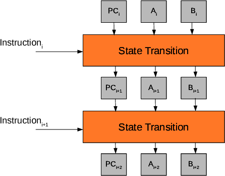
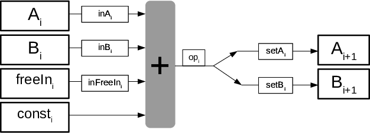
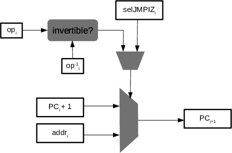

## A Simple State Machine

Let us build an state machine that transitionates from one state to the following one using the rules of a certain instruction. This machine can be represented as follows:

The following assembly program describes a state machine with two registries $A$ and $B$ that accepts a free input:

$$\begin{array}{|l|}
\hline
\mathbf{Instruction} \\ \hline
\mathbf{FREELOAD}~A \\ \hline
\mathbf{MOV}~B~3 \\ \hline
\mathbf{ADD}~A~B \\ \hline
\mathbf{STOP} \\ \hline
\end{array}$$

where:

a)  $\mathbf{FREELOAD}~X$: Take an input and saves its value into register X.

b)  $\mathbf{MOV}~X~a$: Move a constant $a$ into register $X$. 

c)  $\mathbf{ADD}~A~B$: Sum the values of the registers $A$ and $B$ and saves the output into register $A$. 

For example, the execution trace on input $7$ is the following:

$$\begin{array}{|l|c|c|c|c|c|}
\hline
\mathbf{Instruction} & \mathbf{freeIn} & \mathbf{A} & \mathbf{A^{+1}} & \mathbf{B} & \mathbf{B^{+1}} \\ \hline
\mathbf{FREELOAD}~~A & 7 & 0 & 7 & 0 & 0 \\ \hline
\mathbf{MOV}~~B~3 & 0 & 7 & 7 & 0 & 3 \\ \hline
\mathbf{ADD}~~A~B & 0 & 7 & 10 & 3 & 3 \\ \hline
\mathbf{STOP} & 0 & 10 & 0 & 3 & 0 \\ \hline
\end{array}$$

At each instruction, we denote as $X^{+1}$ as the next state of the register $X \in \{A,B\}$. 

Notice that the **STOP** instruction resets the states' values and "glues" the last instruction with the first one, achieving a cycle.

We want to traduce our instructions so that the next state of the machine is deduced from a certain set of values. To achieve this, we add auxiliary states and selectors to express the relations between the next values of registries $A$ and $B$ as a linear combination of the previous ones
and these auxiliary states and selectors.
This is shown in the following figure:

Where we denote:

a)  $\mathbf{inX_i} \in \{0,1\}$: Selector to include or not $X_i$ in
    the linear combination.

b)  $\mathbf{setX_i} \in \{0,1\}$: Selector to move or not the result of
    the linear combination into $X_{i+1}$.

c) **freeIn** contains the inputs that we can freely choose to execute the program.

d) **const** contains the fixed values of the instructions.

Introducing the new auxiliary variables, we have the following extended table:

$$
\scriptsize
\begin{array}{|l|}
\hline
\mathbf{Instruction} \\ \hline
\mathbf{FREELOAD}~~A \\ \hline
\mathbf{MOV}~~B~3 \\ \hline
\mathbf{ADD}~~A~B \\ \hline
\mathbf{STOP} \\ \hline
\end{array}
\hspace{0.1cm}
\begin{array}{|c|c|c|c|c|c|c|c|}
\hline
\textbf{freeIn} & \textbf{const} & \textbf{setB} & \textbf{setA} & \textbf{inFreeIn} & \textbf{inB} & \textbf{inA} \\ \hline
7 & 0 & 0 & 1 & 1 & 0 & 0 \\ \hline
0 & 3 & 1 & 0 & 0 & 0 & 0 \\ \hline
0 & 0 & 0 & 1 & 0 & 1 & 1 \\ \hline
0 & 0 & 1 & 1 & 0 & 0 & 0 \\ \hline
\end{array}
\hspace{0.1cm}
\begin{array}{|c|c|c|c|}
\hline
\mathbf{A} & \mathbf{A^{+1}} & \mathbf{B} & \mathbf{B^{+1}} \\ \hline
0 & 7 & 0 & 0\\ \hline
7 & 7 & 0 & 3\\ \hline
7 & 10 & 3 & 3\\ \hline
10 & 0 & 3 & 0\\ \hline
\end{array}
$$

Henceforth, the relations between the states of the registries can be expressed algebraically as follows: 

$$\begin{aligned}
&\mathsf{A_{i+1}} = \mathsf{A_i} + \mathsf{setA_i} \cdot (\mathsf{inA_i} \cdot \mathsf{A_i} + \mathsf{inB_i} \cdot \mathsf{B_i} + \mathsf{inFreeIn}_i \cdot \mathsf{freeIn_i} + \mathsf{const_i} - \mathsf{A_i}), \\
&\mathsf{B_{i+1}} = \mathsf{B_i} + \mathsf{setB_i} \cdot (\mathsf{inA_i} \cdot \mathsf{A_i} + \mathsf{inB_i} \cdot \mathsf{B_i} +   \mathsf{inFreeIn}_i \cdot \mathsf{freeIn_i} + \mathsf{const_i} - \mathsf{B_i}).
\end{aligned}$$

Let's represent the states of these registries for four steps as polynomials in $\mathbb{Z}_p[x]$ evaluated on the subgroup $H = \{\omega, \omega^2, \omega^3, \omega^4 = 1\}$, in order to produce a cyclic relation:

$$\begin{aligned}
&\mathsf{A}(x\omega) = \mathsf{A}(x) + \mathsf{setA}(x) \cdot (\mathsf{inA}(x) \cdot \mathsf{A}(x) + \mathsf{inB}(x) \cdot \mathsf{B}(x) + \mathsf{inFreeIn}(x) \cdot \mathsf{freeIn}(x) + \mathsf{const}(x) - \mathsf{A}(x)), \\
&\mathsf{B}(x\omega) = \mathsf{B}(x) + \mathsf{setB}(x) \cdot (\mathsf{inA}(x) \cdot \mathsf{A}(x) + \mathsf{inB}(x) \cdot \mathsf{B}(x) + \mathsf{inFreeIn}(x) \cdot \mathsf{freeIn}(x) + \mathsf{const}(x) - \mathsf{B}(x)).
\end{aligned}$$

Observe that the program is completely described by the constant (and public) polynomials **inA(x)**, **inB(x)**, **setA(x)**, **setB(x)**, **inFreeIn(x)** and **const(x)**.

The polynomial **freeIn(x)** can be public or committed and by changing this polynomial, we can proof different executions for different initial conditions for the same "program".

In our previous program, we can provide a result of the execution by giving $A(\omega^4)$.

## Programs with Conditional Jumps

We are going to add the instruction **JMPIZ** to our assembly. **JMPIZ** jumps to a specified position in the program if the 
preceding operation is zero. 

In the next program, **JMPIZ** will jump to position $4$ if $\mathbf{ADD}~A~B$ is $0$: 

$$
\begin{array}{|c|l|}
\hline
\textbf{Position} & \mathbf{Instruction} \\ \hline
0 & \mathbf{FREELOAD}~~A \\ \hline
1 & \mathbf{MOV}~~B~-3 \\ \hline
2 & \mathbf{ADD}~~A~B,~\mathbf{JMPIZ}~~4 \\ \hline
3 & \mathbf{ADD}~~A~B \\ \hline
4 & \mathbf{STOP} \\ \hline
\end{array}
$$

Note. We will discuss later on how to introduce negative values into our program.

In programs with conditional jumps, our previous model will not work, because the flow of the program may vary depending on the values of the input.

As it can be seen next, with conditional jumps, the length of the execution trace is **not constant** (it depends on the free input):

$$\scriptsize
\begin{array}{|l|c|c|c|c|c|}
\hline
\mathbf{Instruction} & \mathbf{freeIn} & \mathbf{A} & \mathbf{A^{+1}} & \mathbf{B} & \mathbf{B^{+1}} \\ \hline
\mathbf{FREELOAD}~~A & 7 & 0 & 7 & 0 & 0 \\ \hline
\mathbf{MOV}~~B~-3 & 0 & 7 & 7 & 0 & -3 \\ \hline
\mathbf{ADD}~~A~B,~\mathbf{JMPIZ}~~4 & 0 & 7 & 4 & -3 & -3 \\ \hline
\mathbf{ADD}~~A~B & 0 & 4 & 1 & -3 & -3 \\ \hline
\mathbf{STOP} & 0 & 1 & 0 & -3 & 0 \\ \hline
\end{array}$$

$$\scriptsize
\begin{array}{|l|c|c|c|c|c|}
\hline
\mathbf{Instruction} & \mathbf{freeIn} & \mathbf{A} & \mathbf{A^{+1}} & \mathbf{B} & \mathbf{B^{+1}} \\ \hline
\mathbf{FREELOAD}~~A & 3 & 0 & 3 & 0 & 0 \\ \hline
\mathbf{MOV}~~B~-3 & 0 & 3 & 3 & 0 & -3 \\ \hline
\mathbf{ADD}~~A~B,~\mathbf{JMPIZ}~~4 & 0 & 3 & 0 & -3 & -3 \\ \hline
\mathbf{STOP} & 0 & 0 & 0 & -3 & 0 \\ \hline
\end{array}$$

The first execution is done in 5 steps, meanwhile the second one has been done in 4 steps. 

### Managing Conditional Jumps

Now, let us introduce a new model to manage a program that contains conditional jumps.

To do this, we need to add the **Program Counter (PC)**. The $\mathsf{PC}$ is a special registry that contains the position of the instruction in the program being executed.

We use $\textsf{op}_i$ as a shorthand for the linear combination of our state machine to simplify the forthcoming constraints:
$$
\mathsf{op}_i := \mathsf{inA_i} \cdot \mathsf{A_i} + \mathsf{inB_i} \cdot \mathsf{B_i} + \mathsf{inFreeIn}_i \cdot \mathsf{freeIn_i} + \mathsf{const_i}.
$$

The **JMPIZ** instruction will jump to the instruction $\textsf{addr}_i$ (specified by the **JMPIZ** instruction) if $\textsf{op}_i$ is zero. Let us first develop some procedure to check if our operation is or not zero in $\mathbb{Z}_p$: 

To check that a number in the field $\mathbb{Z}_p$ is zero, we use the fact that a number $a$ has a multiplicative inverse $a^{-1}$ if and only if $a \neq 0$. 

Using this fact, we use the following definition and constraint to do the **isZero** check:

$$\begin{aligned}
&\mathsf{isZero}_i := (1 - \mathsf{op}_i \cdot \mathsf{op}_i^{-1}), \\
&\mathsf{isZero}_i \cdot \mathsf{op}_i = 0.
\end{aligned}$$

We can proof that the previous equations describe the desired check by case examination where $a \neq 0$
and $\alpha, \beta \in \mathbb{Z}_p$:

$(\mathsf{op}_i = 0,~\mathsf{op}_i^{-1} = \alpha,~\mathsf{isZero}_i = 1)$ **passes** the definition and constraint,

$(\mathsf{op}_i = a,~\mathsf{op}_i^{-1} = a^{-1},~\mathsf{isZero}_i = 0)$ **passes** the definition and constraint.

$(\mathsf{op}_i = 0,~\mathsf{op}_i^{-1} = \alpha,~\mathsf{isZero}_i \neq 1)$ **does not pass** the definition of $\mathsf{isZero}$.

$(\mathsf{op}_i = a,~\mathsf{op}_i^{-1} = \beta,~\mathsf{isZero}_i \neq 0)$ **does not pass** the definition and constraint, 
either you consider $\beta = 0$, $\beta = a^{-1}$ or $\beta \neq a^{-1}$.

We can mix the two equations into just one constraint:
$$
\mathsf{isZero}_i \cdot \mathsf{op}_i = 0,~~\mathsf{isZero}_i = (1 - \mathsf{op}_i \cdot \mathsf{op}_i^{-1})~~\rightarrow~~(1 - \mathsf{op}_i \cdot \mathsf{op}_i^{-1}) \cdot \mathsf{op}_i = 0.
$$

Let us introduce the following machinery to our setup in order to introduce jumps:

We add a selector $\textsf{selJMPIZ}_i \in \{0,1\}$ to our state machine to code the **JMPIZ** instruction and express the behaviour of the **PC**. Then, the set of constraints is the following:

$$\begin{aligned}
&\mathsf{op}_i := \mathsf{inA_i} \cdot \mathsf{A_i} + \mathsf{inB_i} \cdot \mathsf{B_i} + \mathsf{inFreeIn}_i \cdot \mathsf{freeIn_i} + \mathsf{const_i}, \\
&\mathsf{PC}_{i+1} = \mathsf{PC}_i + 1 + \mathsf{selJMPIZ}_i \cdot (1 - \mathsf{op}_i \cdot \mathsf{op}_i^{-1}) \cdot (\mathsf{addr}_i  - \mathsf{PC}_i - 1),\\
&(1 - \mathsf{op}_i \cdot \mathsf{op}_i^{-1}) \cdot \mathsf{op}_i = 0.
\end{aligned}$$

Observe that:

1. If $\mathsf{op}_i \neq 0$, then $(1 - \mathsf{op}_i \cdot \mathsf{op}_i^{-1}) = 0$ and hence $\mathsf{PC}_{i+1} = \mathsf{PC}_{i} + 1$; 
1. If $\mathsf{op}_i = 0$, then $(1 - \mathsf{op}_i \cdot \mathsf{op}_i^{-1}) = 1$ and hence $\mathsf{PC}_{i+1} = \mathsf{PC}_{i} + 1 + \mathsf{addr}_i  - \mathsf{PC}_i - 1 = \mathsf{addr}_i$.

This is exactly the wanted behaviour.

Next, we show the execution traces for the free inputs 7 and 3 respectively:

$$
\tiny
\begin{array}{|l|}
\hline
\mathbf{Instruction} \\ \hline
\mathbf{FREELOAD}~~A \\ \hline
\mathbf{MOV}~~B~-3 \\ \hline
\mathbf{ADD}~~A~B,~\mathbf{JMPIZ}~~4 \\ \hline
\mathbf{ADD}~~A~B \\ \hline
\mathbf{STOP} \\ \hline
\end{array}
\hspace{0.1cm}
\begin{array}{|c|c|c|c|c|c|c|c|c|c|c|}
\hline
\textbf{freeIn} & \textbf{const} & \textbf{addr} & \textbf{selJMPIZ} & \textbf{setB} & \textbf{setA} & \textbf{inFreeIn} &  \textbf{inB} & \textbf{inA} & \textbf{op} & \textbf{invOp} \\ \hline
7 & 0 & 0 & 0 & 0 & 1 & 1 & 0 & 0 & 7 & 7^{-1} \\ \hline
0 & -3 & 0 & 0 & 1 & 0 & 0 & 0 & 0 & -3 & (-3)^{-1} \\ \hline
0 & 0 & 4 & 1 & 0 & 1 & 0 & 1 & 1 & \mathbf{\color{blue!75!black} 4} & \mathbf{\color{blue!75!black} 4^{-1}} \\ \hline
0 & 0 & 0 & 0 & 0 & 1 & 0 & 1 & 1 & 1 & 1 \\ \hline
0 & 0 & 0 & 1 & 1 & 1 & 0 & 0 & 0 & 0 & 0 \\ \hline
\end{array}
\hspace{0.1cm}
\begin{array}{|c|c|c|c|c|c|}
\hline
\mathbf{PC} & \mathbf{PC^{+1}} & \mathbf{A} & \mathbf{A^{+1}} & \mathbf{B} & \mathbf{B^{+1}} \\ \hline
0 & 1 & 0 & 7 & 0 & 0\\ \hline
1 & 2 & 7 & 7 & 0 & -3\\ \hline
2 & 3 & 7 & 4 & -3 & -3\\ \hline
3 & 4 & 4 & 1 & -3 & -3\\ \hline
4 & 0 & 1 & 0 & -3 & 0\\ \hline
\end{array}
$$ 

$$
\tiny
\begin{array}{|l|}
\hline
\mathbf{Instruction} \\ \hline
\mathbf{FREELOAD}~~A \\ \hline
\mathbf{MOV}~~B~-3 \\ \hline
\mathbf{ADD}~~A~B,~\mathbf{JMPIZ}~~4 \\ \hline
\mathbf{STOP} \\ \hline
\end{array}
\hspace{0.1cm}
\begin{array}{|c|c|c|c|c|c|c|c|c|c|c|c|}
\hline
\textbf{freeIn} & \textbf{const} & \textbf{addr} & \textbf{selJMPIZ} & \textbf{setB} & \textbf{setA} & \textbf{inFreeIn} &  \textbf{inB} & \textbf{inA} & \textbf{op} & \textbf{invOp} \\ \hline
3 & 0 & 0 & 0 & 0 & 1 & 1 & 0 & 0 & 3 & 3^{-1} \\ \hline
0 & -3 & 0 & 0 & 1 & 0 & 0 & 0 & 0 & -3 & (-3)^{-1} \\ \hline
0 & 0 & 4 & 1 & 0 & 1 & 0 & 1 & 1 & \mathbf{\color{blue!75!black} 0} & \mathbf{\color{blue!75!black} \alpha} \\ \hline
0 & 0 & 0 & 1 & 1 & 1 & 0 & 0 & 0 & 0 & 0 \\ \hline
\end{array}
\hspace{0.1cm}
\begin{array}{|c|c|c|c|c|c|}
\hline
\mathbf{PC} & \mathbf{PC^{+1}} & \mathbf{A} & \mathbf{A^{+1}} & \mathbf{B} & \mathbf{B^{+1}} \\ \hline
0 & 1 & 0 & 3 & 0 & 0\\ \hline
1 & 2 & 3 & 3 & 0 & -3\\ \hline
2 & 4 & 3 & 0 & -3 & -3\\ \hline
4 & 0 & 0 & 0 & -3 & 0\\ \hline
\end{array}
$$

Note that we use **invOp** for the column containing the inverses of **op**.

Note also that the **PC** turns to be an important registry when jumps are included in the set of possible instructions because jumps can modify the sequence of instructions that is executed also known as "the trace".

Now, our polynomials are definitely not preprocessed, this is because the values of the table will not only depend on the program, but also on the free input values. Hence, we need to ensure that we are verifying the correct program. 

### Proving the Execution of the "Correct Program"

Up to now, we can prove that each instruction is correctly executed, but, how do we prove that we are executing the correct set of instructions, that is to say, that we are executing the "correct program"?
The solution seems obvious: Check that every executed instruction is some instruction in the program,
but how do we do this in a succinct manner?

To do so, we have to provide **a codification for each instruction** and then we will check that the codification of the execution's instructions is included in the codification of the program's instructions.

Let's begin showing how to encode the constant values of our instructions. As a particular example, consider that we want to use signed integers of 4 bits (in the real machine, we will use an analogous 32 bits codification).
The four bit codification is shown next: 

$$\begin{array}{|c|c|c|c|c|c|c|c|c|c|c|c|c|}
\hline
-8 & -7 & -6 & ... & -2 & -1 & 0 & 1 & 2 & ... & 6 & 7 & 8 \\ \hline
1000 & 1001 & 0110 & ... & 1110 & 1111 & 0000 & 0001 & 0010 & ... & 0110 & 0111 & 1000 \\ \hline
\end{array}$$

Notice that with this arithmetic $8=-8$, which is a weird case that we discard, using only values from -7 to 7.
Then, we encode these values in elements of the field $\mathbb{Z}_p$:

$$\begin{array}{|c|c|c|c|c|c|c|c|c|c|c|}
\hline
-7 & -6 & ... & -2 & -1 & 0 & 1 & 2 & ...& 6 & 7 \\ \hline
p-7 & p-6 & ... & p-2 & p-1 & 0 & 1 & 2 & ...& 6 & 7  \\ \hline
\end{array}$$

So, we have to enforce that $const(x) \in \{p-7, p-6, ..., p-2, p-1, 0,1,2, ..., 6, 7\}$.

We enforce the previous condition with the following equivalent inclusion: 

$$const(x) + 7 \in \{0,1,2,...,14\}$$

Hence, we will use $const(x) + 7$ in base $2$ instead of $const(x)$ to encode our instruction, just to avoid the sum. 

Let's now explain how to encode every **distinct** instruction to be executed by the program: 

$$
\scriptsize
\begin{array}{|c|l|}
\hline
\mathbf{Instruction} \\ \hline
\mathbf{FREELOAD}~~A \\ \hline
\mathbf{MOV}~~B~-3 \\ \hline
\mathbf{ADD}~~A~B,~\mathbf{JMPIZ}~~4 \\ \hline
\mathbf{ADD}~~A~B \\ \hline
\mathbf{STOP} \\ \hline
\end{array}
\hspace{0.1cm}
\begin{array}{|c|c|c|c|c|c|c|c|c|c|c|}
\hline
\mathbf{\color{blue!75!black} \textbf{const+7}} & \textbf{addr} & \textbf{selJMPIZ} & \textbf{setB} & \textbf{setA} & \textbf{inFreeIn} & \textbf{inB} & \textbf{inA} & \textbf{instruction code} \\ \hline
\mathbf{\color{blue!75!black} 7} & 0 & 0 & 0 & 1 & 1 & 0 & 0 & 0111.0000.001100 \\ \hline
\mathbf{\color{blue!75!black} 4} & 0 & 0 & 1 & 0 & 0 & 0 & 0 & 0100.0000.010000 \\ \hline
\mathbf{\color{blue!75!black} 7} & 4 & 1 & 0 & 1 & 0 & 1 & 1 & 0111.0100.101011 \\ \hline
\mathbf{\color{blue!75!black} 7} & 0 & 0 & 0 & 1 & 0 & 1 & 1 & 0111.0000.001011 \\ \hline
\mathbf{\color{blue!75!black} 7} & 0 & 1 & 1 & 1 & 0 & 0 & 0 & 0111.0000.111000 \\ \hline
\end{array}
$$

Observe that we have codified the instruction using the following rule:
$$
\textsf{instruction}_i := 2^{13}\cdot(\textsf{const}_i + 7) + 2^9\cdot \textsf{addr}_i + 2^5\cdot \textsf{selJMPIZ}_i + 2^4 \cdot \textsf{setB}_i + 2^3 \cdot \textsf{setA}_i + 2^2 \cdot \textsf{inFreeIn}_i + 2 \cdot \textsf{inB}_i + \textsf{inA}_i.
$$

That is, we are codifying it as the concatenated base $2$ integer of all the values (in the order of appearance on the table).

Note that additionally, we will need to check that the selectors are binary and that $\textbf{addr}$ is composed of $4$ bits, i.e., $\textsf{addr}_i \in \{0, 1, \dots, 15\}$

Also observe that, when $\textsf{const}_i+7 = 7$, this means that $\textsf{const}_i = 0$, so the constant is not used in those cases. 

Now, to prove the program, every instruction will be uniquely identified by its code and position in the program (we also use 4 bits in this example for the position).

We define the **ROM** of the program as the sum between every instruction and the position in which it is defined:
$$
\textsf{ROM}_i := 2^{17}  \cdot \textsf{position}_i + \textsf{instruction}_i.
$$

Observe that the **ROM** uniquely identifies the program we want to verify and it is independent of the different possible executions. 

The resulting **ROM** of our program is the following:

$$
\begin{array}{|c|c|}
\hline
\textbf{Position} & \mathbf{Instruction} \\ \hline
0 & \mathbf{FREELOAD}~~A \\ \hline
1 & \mathbf{MOV}~~B~-3 \\ \hline
2 & \mathbf{ADD}~~A~B,~\mathbf{JMPIZ}~~4 \\ \hline
3 & \mathbf{ADD}~~A~B \\ \hline
4 & \mathbf{STOP} \\ \hline
\end{array}
\hspace{0.1cm}
\begin{array}{|c|}
\hline
\textbf{ROM} \\ \hline
0000.0111.0000.001100 \\ \hline
0001.0100.0000.010000 \\ \hline
0010.0111.0100.101011 \\ \hline
0011.0111.0000.001011 \\ \hline
0100.0111.0000.111000 \\ \hline
\end{array}
$$

We will encode the program trace using the PC:

$$
\scriptsize
\begin{array}{|c|c|c|c|c|c|}
\hline
\mathbf{PC} \\ \hline
0 \\ \hline
1 \\ \hline
2 \\ \hline
3 \\ \hline
4 \\ \hline
\end{array}
\hspace{0.1cm}
\begin{array}{|c|c|c|}
\hline
\mathbf{Instruction} \\ \hline
\mathbf{FREELOAD}~~A \\ \hline
\mathbf{MOV}~~B~-3 \\ \hline
\mathbf{ADD}~~A~B,~\mathbf{JMPIZ}~~4 \\ \hline
\mathbf{ADD}~~A~B \\ \hline
\mathbf{STOP} \\ \hline
\end{array}
\hspace{0.1cm}
\begin{array}{|c|c|c|c|c|c|c|c|c|}
\hline
\textbf{const+7} & \textbf{addr} & \textbf{selJMPIZ} & \textbf{setB} & \textbf{setA} & \textbf{inFreeIn} &  \textbf{inB} & \textbf{inA} \\ \hline
7 & 0 & 0 & 0 & 1 & 1 & 0 & 0 \\ \hline
4 & 0 & 0 & 1 & 0 & 0 & 0 & 0 \\ \hline
7 & 4 & 1 & 0 & 1 & 0 & 1 & 1 \\ \hline
7 & 0 & 0 & 0 & 1 & 0 & 1 & 1 \\ \hline
7 & 0 & 1 & 1 & 1 & 0 & 0 & 0 \\ \hline
\end{array}
\hspace{0.1cm}
\begin{array}{|c|c|c|c|c|c|}
\hline
\mathbf{insTrace} \\ \hline
0000.0111.0000.001100 \\ \hline
0001.0100.0000.010000 \\ \hline
0010.0111.0100.101011 \\ \hline
0011.0111.0000.001011 \\ \hline
0100.0111.0000.111000 \\ \hline
\end{array}
$$

$$
\scriptsize
\begin{array}{|c|c|c|c|c|c|}
\hline
\mathbf{PC} \\ \hline
0 \\ \hline
1 \\ \hline
2 \\ \hline
4 \\ \hline
\end{array}
\hspace{0.1cm}
\begin{array}{|c|c|c|}
\hline
\mathbf{Instruction} \\ \hline
\mathbf{FREELOAD}~~A \\ \hline
\mathbf{MOV}~~B~-3 \\ \hline
\mathbf{ADD}~~A~B,~\mathbf{JMPIZ}~~4 \\ \hline
\mathbf{STOP} \\ \hline
\end{array}
\hspace{0.1cm}
\begin{array}{|c|c|c|c|c|c|c|c|c|c|}
\hline
\textbf{const+7} & \textbf{addr} & \textbf{selJMPIZ} & \textbf{setB} & \textbf{setA} & \textbf{inFreeIn} &  \textbf{inB} & \textbf{inA} \\ \hline
7 & 0 & 0 & 0 & 1 & 1 & 0 & 0 \\ \hline
4 & 0 & 0 & 1 & 0 & 0 & 0 & 0 \\ \hline
7 & 4 & 1 & 0 & 1 & 0 & 1 & 1 \\ \hline
7 & 0 & 1 & 1 & 1 & 0 & 0 & 0 \\ \hline
\end{array}
\hspace{0.1cm}
\begin{array}{|c|c|c|c|c|c|}
\hline
\mathbf{insTrace} \\ \hline
0000.0111.0000.001100 \\ \hline
0001.0100.0000.010000 \\ \hline
0010.0111.0100.101011 \\ \hline
0100.0111.0000.111000 \\ \hline
\end{array}
$$

Notice that the STOP instruction also sets the PC to zero, which will make the polynomial identities cyclic.

Recall that our main question was: **How do we actually check correctness in an efficient manner?**

We can achieve it with the [Plookup](https://eprint.iacr.org/2020/315.pdf) protocol. So, to check that the correct program is being executed, we simply have to use Plookup to determine if:

$$\mathbf{insTrace(x)} \subset \mathbf{ROM(x)}$$

In words, the trace being executed is an execution of the actual program if the instruction trace is contained in the ROM of the program.

### Identities to Prove an Execution Trace 

As a summary, we have seen that the following set of identities are used to define our program:

$$\begin{aligned}
&\mathsf{A}(x\omega) = \mathsf{A}(x) + \mathsf{setA}(x) \cdot (\mathsf{op}(x) - \mathsf{A}(x)), \\
&\mathsf{B}(x\omega) = \mathsf{B}(x) + \mathsf{setB}(x) \cdot (\mathsf{op}(x) - \mathsf{B}(x)), \\
&\mathsf{PC}(x\omega) = \mathsf{PC}(x) + 1 + \mathsf{selJMPIZ}(x) \cdot (1 - \mathsf{op}(x) \cdot \mathsf{invOp}(x)) \cdot (\mathsf{addr}(x)  - \mathsf{PC}(x) - 1), \\
&(1 - \mathsf{op}(x) \cdot \mathsf{invOp}(x)) \cdot \mathsf{op}(x) = 0.
\end{aligned}$$

With the following definition:
$$
\mathsf{op}(x) := \mathsf{inA}(x) \cdot \mathsf{A}(x) + \mathsf{inB}(x) \cdot \mathsf{B}(x) + \mathsf{inFreeIn}(x) \cdot \mathsf{freeIn}(x) + \mathsf{const}(x).
$$

Moreover, we should add the following Plookup checks: 

$$\begin{aligned}
&\textsf{const}(x) + 7 \subset \{0,1, \dots, 14\},\\
&\mathsf{addr}(x) \subset \{0,1, \dots, 15\},\\
&\mathsf{position}(x) \subset \{0,1, \dots, 15\},\\
&\mathsf{PC}(x) \subset \{0,1, \dots, 15\},\\
&\textsf{insTrace}(x) \subset \textsf{ROM}(x).
\end{aligned}$$

With the following definitions:

$$\begin{aligned}
&\textsf{instruction}(x) := 2^{13}\cdot(\textsf{const}(x) + 7) + 2^9\cdot \textsf{addr}(x) + 2^5\cdot \textsf{selJMPIZ}(x) + 2^4 \cdot \textsf{setB}(x) + \\ 
&\qquad \qquad \qquad \quad~~ 2^3 \cdot \textsf{setA}(x) + 2^2 \cdot \textsf{inFreeIn}(x) + 2 \cdot \textsf{inB}(x) + \textsf{inA}(x),\\
&\textsf{ROM}(x) := 2^{17}  \cdot \textsf{position}(x) + \textsf{instruction}(x), \\
&\textsf{insTrace}(x) := 2^{17}  \cdot \textsf{PC}(x) + \textsf{instruction}(x).
\end{aligned}$$

Finally, it should be checked that the whole set of selectors are, in fact, binary:

$$\begin{aligned}
&\mathsf{inA}(x) \cdot (\mathsf{setA}(x) - 1) = 0, \quad \mathsf{setA}(x) \cdot (\mathsf{setA}(x) - 1) = 0, \quad\\
&\mathsf{inB}(x) \cdot (\mathsf{setB}(x)- 1) = 0, \quad \mathsf{setB}(x) \cdot (\mathsf{setB}(x) - 1) = 0, \quad\\
&\mathsf{inFreeIn}(x) \cdot (\mathsf{inFreeIn}(x) - 1) = 0, \quad \mathsf{selJMPIZ}(x) \cdot (\mathsf{selJMPIZ}(x) - 1) = 0.
\end{aligned}$$

Regarding the polynomials, in this state machine:

1. We have to commit $\textsf{inFreeIn}(x), \textsf{inA}(x), \textsf{inB}(x), \textsf{setA}(x), \textsf{setB}(x)$ $\textsf{A}(x), \textsf{B}(x), \textsf{const}(x),$ $\textsf{selJMPIZ}(x),$ $\textsf{invOp}(x)$, $\textsf{addr}(x)$, $\textsf{freeIn}(x)$, $\textsf{position}(x)$ and $\textsf{PC}(x)$.

1. While the only constant (preprocessed) polynomial is $\textsf{ROM}(x)$.
