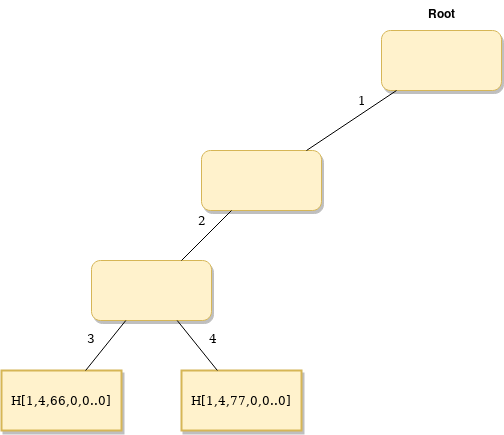

# Merkle Tree Specification

This document describes the Merkle Tree that is used. Basic understanding on how Merkle trees and Merkle proofs work is assumed.

## Glossary

- **Key**: position of a leaf in the tree.
- **Branch**: node of the tree that have children insted of data, e.g: a non-leaf node.
- **Leaf**: node of the tree that stores data.

## Topology

- Hexary (16 child per branch, could be 8 if deemed necessary to reduce complexity in zk circuits).
- Number of levels doesn't have to be fixed, because STARK allows to compute it dynamically. Max levels is 64 due to key size. At least 32 levels (we may consider using more levels to avoid collisions. Amount of leafs = `16**levels`. 32 levels ~= 3.4e38).
- Sparse.

## Keys and Paths

A key is the index of a leaf. They've to be generated in a way that there are no collisions and are deterministic (same leaf always have the same key). Therefore a convinient way to generate keys is by hashing some content of the leaf that uniquely identifies it. Poseidon hash will be used for that purpose (could be changed).

A path is a list of directions that enable navigation from root to a given leaf. Paths are derived from keys by taking the **last** `4bits * (Levels-1)`, each 4 bit group will represent a number (values 0 to 15) that indicates which is the child of the branch that follows the path to the leaf.

Since poseidon hashes output 253,59 bits, and 4 bits are needed to encode each direction, the tree can have a maximum of 64 levels: `253.59bits / 4bits = Levels-1`.

Keys are Finite Field Elements.
Values are numbers between $0$ and $2^{256}-1$ (uint256).

## Example

Given a tree with 8 levels (for example purposes, the actual implementation will have at least 32 levels), and the following key, the path will be this:

Key (in Little Endian encoding): `0x21665a9251173584a82d950b0ea5f3c19297fdce2383ef325d3c01cb30191d10`

Path:

|            | direction | used bits |
| ---------- | --------- | --------- |
| Root => L1 | 0x0       | 252:256   |
| L1 => L2   | 0x1       | 248:252   |
| L2 => L3   | 0xd       | 244:248   |
| L3 => L4   | 0x1       | 240:244   |
| L4 => L5   | 0x9       | 236:240   |
| L5 => L6   | 0x1       | 232:236   |
| L6 => L7   | 0x0       | 228:232   |

Graphical representation:

[](https://i.imgur.com/cuN23kj.png)

## Reference Implementation

Jordi has done js implementation here: [hermeznetwork/zkproverjs](https://github.com/hermeznetwork/zkproverjs/blob/main/src/smt.js)

## Example of MT Creation

Initially we have an empty MT, that has zero value as a root hash.
For the example purpose it has 5 levels and keys are 2 bytes long (4 bits \* 4).

### Step 1

Adding first leaf to sparse MT:

- Key: `0x4321`
- Value: `0x66`

Leafs:

| Key (LE) | Path | Value | Real Path | Hash                      |
| -------- | ---- | ----- | --------- | ------------------------- |
| 4321     | 1234 | 66    | -         | H[1,1234,66,0,0,0,0,0..0] |

Merkle root hash equals to the hash of the leaf node, which is `H[1,1234,66,0,0..0]`, since there's no other leaves in the tree. `keyPrime` equals to Path.

Graphical representation:

[](https://i.imgur.com/RmxHyCF.png)

- _Yellow nodes need (re)calculation_

### Step 2

Adding second leaf:

- Key: `0x4421`
- Value: `0x77`

Leafs:

| Path | Value | Real Path | Hash                 |
| ---- | ----- | --------- | -------------------- |
| 1234 | 66    | 123       | H[1,4,66,0,0,0,0..0] |
| 1244 | 77    | 124       | H[1,4,77,0,0,0,0..0] |

Graphical representation:

[](https://i.imgur.com/KqR96E8.png)

- _Yellow nodes need (re)calculation_

### Step 3

Adding third leaf:

- Key: `0x6541`
- Value: `0x88`

Leafs:

| Path | Value | Real Path | Hash                  |
| ---- | ----- | --------- | --------------------- |
| 1234 | 66    | 123       | H[1,4,66,0,0,0,0..0]  |
| 1244 | 77    | 124       | H[1,4,77,0,0,0,0..0]  |
| 1456 | 88    | 14        | H[1,56,88,0,0,0,0..0] |

Graphical representation:

[](https://i.imgur.com/I69k5zZ.png)

- _Yellow nodes need (re)calculation_

### Step 4

Adding fourth leaf:

- Key: `0x5541`
- Value: `0x99`

Leafs:

| Path | Value | Real Path | Hash                 |
| ---- | ----- | --------- | -------------------- |
| 1234 | 66    | 123       | H[1,4,66,0,0,0,0..0] |
| 1244 | 77    | 124       | H[1,4,77,0,0,0,0..0] |
| 1455 | 99    | 145       | H[1,5,99,0,0,0,0..0] |
| 1456 | 88    | 145       | H[1,6,88,0,0,0,0..0] |

Graphical representation:

[](https://i.imgur.com/xJlQOM1.png)

- _Yellow nodes need (re)calculation_

## Nodes

Hermez 1.5 has 2 categories of nodes:

- **Leafs**: node of the tree that instead of pointing to other nodes, it holds data. There is 4 types of leafs:
    - Nonce: Counter of transactions made by an account
    - Balance: amount of Ether holded by an account
    - SC code: code of a smart contract
    - SC storage: persistent data stored by a smart contract
- **Branches**: node of the tree that point to other nodes.

### Leafs

Generic schema to generate node hash: `poseidon.Hash(1, keyPrime, V0, V1, V2, V3, 0, 0, 0, 0, 0, 0, 0, 0, 0, 0)`
where:

- `keyPrime` - is a remaining part of the key, depends on a position of the Leaf in the Tree
- `V0, V1, V2, V3` - parts of Value split in 64 bit chunks

    <table>
        <tr>
            <th colspan="4"><center>Value, 256 bits</center></th>
        </tr>
        <tr>
            <td>MSB</td>
            <td></td>
            <td></td>
            <td>LSB</td>
        </tr>
        <tr>
            <td>64 bits</td>
            <td>64 bits</td>
            <td>64 bits</td>
            <td>64 bits</td>
        </tr>
        <tr>
            <td>V3</td>
            <td>V2</td>
            <td>V1</td>
            <td>V0</td>
        </tr>
    </table>


- `0 ... 0` - zero padding to get 16 inputs to poseidon hash in total, in this case 10 additional zero values

### Branches

- Value: array of 16 poseidon hashes
- Key: -
- Hash: `poseidon.Hash(hashChild0, hashChild1, ..., hashChild15)`

## Proofs

Proofs are very similar to the implementation used in Hermez 1.0.

### Proof of Leaf Inclusion in Merkle Tree

This type of proof is needed to prove that a key in Merkle Tree has specific value.

Structure of the proof from a reference implementation:

```json
{
    root: root,
    key: key,
    value: value,
    siblings: siblings,
    isOld0: isOld0, // true if leaf hash is 0
    insKey: insKey,
    insValue: insValue,
}
```

### Proof of Leaf Update

This type of proof is needed as an input for the ZKP, to prove the transiction from one state `state A` to the next one `state B`.

Structure of the proof from a reference implementation:

```json
{
    oldRoot: oldRoot,
    newRoot: newRoot,
    key: key,
    siblings: siblings, // array [level][keys[level]] bytes,
    insKey: insKey,
    insValue: insValue,
    isOld0: isOld0, // true if previous leaf hash was 0
    oldValue: oldValue,
    newValue: value,
}
```

---

## Hermez specific Leaf Types

### Balance

- Value: unsigned integer of 256 bits
- Key: key is generated by hashing the Ethereum address and a constant with value 0 using Poseidon: `key = poseidon.Hash(ethAddrBytes[0:8], ethAddrBytes[8:16], ethAddrBytes[16:24], 0, 0..0)`
- Hash: `poseidon.Hash(1, keyPrime, balanceBytes[0:8], balanceBytes[8:16], balanceBytes[16:24], balanceBytes[24:32], 0..0)`

### Nonce

- Value: unsigned integer of 256 bits
- Key: key is generated by hashing the Ethereum address and a constant with value 1 using Poseidon: `key = poseidon.Hash(ethAddrBytes[0:8], ethAddrBytes[8:16], ethAddrBytes[16:24], 1, 0..0)`
- Hash: `poseidon.Hash(1, keyPrime, nonceBytes[0:8], nonceBytes[8:16], nonceBytes[16:24], nonceBytes[24:32], 0..0)`

### SC Code

- Value: byte array that represents the compiled code
- Key: key is generated by hashing the Ethereum address and a constant with value 2 using Poseidon: `key = poseidon.Hash(1, keyPrime, ethAddrBytes[0:8], ethAddrBytes[8:16], ethAddrBytes[16:24], 2, 0..0)`
- Hash: **TBD**
  - probably by splitting the code into chunks of 15 elements, and hashing the 15 elements and the hash of the previous chunk

### SC storage

- Value: 256 bits that will be interpreted by the SC
- Key: key is generated by hashing the Ethereum address and a constant with value 3 and the position of the storage that is being accessed: `key = poseidon.Hash(ethAddrBytes[0:8], ethAddrBytes[8:16], ethAddrBytes[16:24], 3, storagePositionBytes[0:8], storagePositionBytes[8:16], storagePositionBytes[16:24], storagePositionBytes[24:32], 0..0)`
- Hash: `poseidon.Hash(1, keyPrime, valueBytes[0:8], valueBytes[8:16], valueBytes[16:24], valueBytes[24:32], 0..0)`